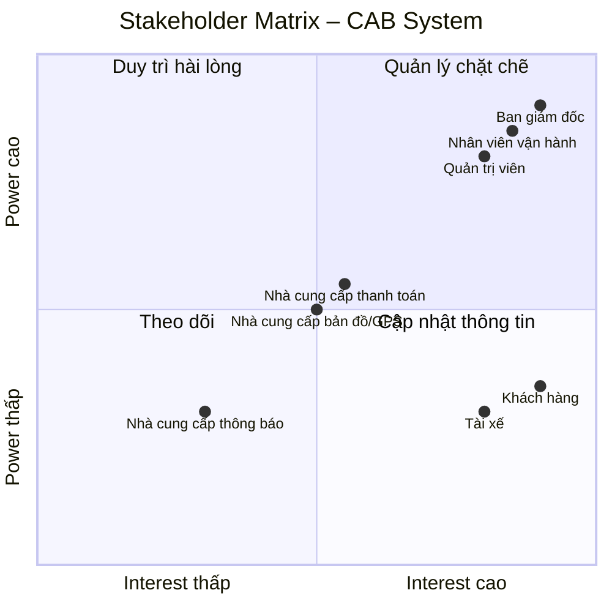

Stakeholder chính:

Ban giám đốc
Khách hàng
Tài xế
Nhân viên vận hành
Quản trị viên

# Stakeholder – CAB System

| Tên stakeholder | Vai trò stakeholder chính |
|---|---|
| **Ban giám đốc Công ty ABC** | Định hướng dự án, xác định mục tiêu và yêu cầu kinh doanh; theo dõi các báo cáo về số lượng chuyến, doanh thu, tỷ lệ hoàn thành, tỷ lệ hủy và hiệu quả hoạt động của tài xế. |
| **Khách hàng** | Đăng ký tài khoản, đặt xe, theo dõi chuyến đi, thanh toán, xem lịch sử chuyến và đánh giá tài xế. |
| **Tài xế** | Quản lý hồ sơ, phương tiện và trạng thái hoạt động; nhận và thực hiện chuyến, cập nhật trạng thái và vị trí. |
| **Nhân viên vận hành** | Quản lý khách hàng, tài xế, phương tiện và chuyến đi; theo dõi các chuyến đang diễn ra và hỗ trợ xử lý các trường hợp chuyến bị lỗi. |
| **Quản trị viên hệ thống** | Quản lý tài khoản, phân quyền và kiểm soát các thao tác quản trị nhạy cảm trên hệ thống. |
| **Nhà cung cấp dịch vụ thanh toán** | Xử lý các giao dịch thanh toán điện tử cho khách hàng thông qua hệ thống CAB. |
| **Nhà cung cấp dịch vụ bản đồ/GPS** | Cung cấp thông tin vị trí, khoảng cách và hỗ trợ tìm tài xế gần khách hàng, dự kiến thời gian tài xế đến. |
| **Nhà cung cấp dịch vụ thông báo** | Cung cấp các kênh gửi thông báo đến khách hàng và tài xế về trạng thái chuyến đi, thanh toán và các thay đổi liên quan. |

# Stakeholder Matrix – CAB System

| Stakeholder | Power | Interest | Chiến lược quản lý |
|---|---|---|---|
| **Ban giám đốc Công ty ABC** | Cao | Cao | Quản lý chặt chẽ; thường xuyên trao đổi, báo cáo tiến độ và xác nhận các quyết định quan trọng. |
| **Khách hàng** | Thấp | Cao | Thường xuyên cập nhật và thu thập phản hồi để đảm bảo hệ thống đáp ứng nhu cầu sử dụng. |
| **Tài xế** | Thấp | Cao | Thường xuyên trao đổi và thu thập phản hồi về quy trình nhận, thực hiện và hoàn thành chuyến. |
| **Nhân viên vận hành** | Cao | Cao | Quản lý chặt chẽ; tham gia phân tích nghiệp vụ, kiểm thử và xác nhận các quy trình vận hành. |
| **Quản trị viên hệ thống** | Cao | Cao | Quản lý chặt chẽ; tham gia xác định yêu cầu về tài khoản, phân quyền và bảo mật. |
| **Nhà cung cấp dịch vụ thanh toán** | Trung bình | Trung bình | Duy trì quan hệ và phối hợp khi tích hợp, xử lý giao dịch hoặc sự cố thanh toán. |
| **Nhà cung cấp dịch vụ bản đồ/GPS** | Trung bình | Trung bình | Duy trì quan hệ; phối hợp về dữ liệu vị trí, khoảng cách và dịch vụ bản đồ. |
| **Nhà cung cấp dịch vụ thông báo** | Trung bình | Thấp | Theo dõi và cung cấp thông tin cần thiết khi tích hợp hoặc xử lý sự cố thông báo. |

## Stakeholder Matrix – CAB System

### Power – Interest Matrix

# Business Rules – CAB System MVP

## 1. Quy tắc tài khoản và phân quyền

| Mã | Business Rule |
|---|---|
| **BR-01** | Khách hàng và tài xế phải được xác thực trước khi sử dụng các chức năng yêu cầu tài khoản. |
| **BR-02** | Chỉ người dùng có quyền phù hợp mới được thực hiện các thao tác quản trị. |
| **BR-03** | Thông tin cá nhân của khách hàng và tài xế phải được bảo vệ. |

## 2. Quy tắc đặt xe

| Mã | Business Rule |
|---|---|
| **BR-04** | Một yêu cầu đặt xe phải có điểm đón, điểm đến và loại xe. |
| **BR-05** | Sau khi khách hàng gửi yêu cầu, hệ thống phải chuyển yêu cầu sang trạng thái tìm tài xế. |
| **BR-06** | Khách hàng phải được thông báo về trạng thái xử lý yêu cầu đặt xe. |

## 3. Quy tắc tìm và phân công tài xế

| Mã | Business Rule |
|---|---|
| **BR-07** | Hệ thống chỉ xem xét các tài xế đang ở trạng thái sẵn sàng nhận chuyến. |
| **BR-08** | Tài xế được lựa chọn phải phù hợp với loại xe mà khách hàng yêu cầu. |
| **BR-09** | Hệ thống phải ưu tiên tài xế phù hợp và gần điểm đón của khách hàng. |
| **BR-10** | Nếu tài xế được đề xuất không phản hồi hoặc từ chối chuyến, hệ thống phải tiếp tục tìm tài xế khác. |
| **BR-11** | Nếu không tìm được tài xế phù hợp, hệ thống phải thông báo cho khách hàng. |
| **BR-12** | Khi tài xế chấp nhận chuyến, hệ thống phải ghi nhận tài xế được phân công cho chuyến đó. |

## 4. Quy tắc thực hiện chuyến

| Mã | Business Rule |
|---|---|
| **BR-13** | Tài xế phải cập nhật trạng thái chuyến trong quá trình thực hiện. |
| **BR-14** | Các trạng thái chính của chuyến gồm: tìm tài xế, đã phân công tài xế, tài xế đến điểm đón, đã đón khách, đang di chuyển và hoàn thành. |
| **BR-15** | Khi chuyến hoàn thành, hệ thống phải ghi nhận thông tin chuyến để phục vụ tính cước, thanh toán và lưu lịch sử. |
| **BR-16** | Hệ thống phải lưu thông tin vị trí của tài xế để hỗ trợ tìm tài xế và dự kiến thời gian đến. |

## 5. Quy tắc tính cước và thanh toán

| Mã | Business Rule |
|---|---|
| **BR-17** | Sau khi chuyến hoàn thành, hệ thống phải xác định số tiền khách hàng phải trả dựa trên loại dịch vụ và thông tin chuyến đi. |
| **BR-18** | Khách hàng được phép thanh toán bằng tiền mặt hoặc phương thức thanh toán điện tử được hệ thống hỗ trợ. |
| **BR-19** | Thông tin nhạy cảm của thẻ hoặc tài khoản thanh toán không được lưu trực tiếp trong hệ thống CAB. |
| **BR-20** | Thanh toán điện tử phải được xử lý thông qua nhà cung cấp dịch vụ thanh toán bên ngoài. |
| **BR-21** | Khi thanh toán điện tử thất bại, hệ thống phải thông báo cho khách hàng và cho phép xử lý lại theo chính sách của doanh nghiệp. |

## 6. Quy tắc thông báo

| Mã | Business Rule |
|---|---|
| **BR-22** | Khách hàng phải được thông báo khi yêu cầu đặt xe được tiếp nhận. |
| **BR-23** | Khách hàng phải được thông báo khi tài xế nhận chuyến. |
| **BR-24** | Khách hàng phải được thông báo khi tài xế đến điểm đón. |
| **BR-25** | Khách hàng phải được thông báo khi chuyến xe hoàn thành và khi thanh toán có kết quả. |
| **BR-26** | Tài xế phải được thông báo khi có chuyến mới hoặc có thay đổi liên quan đến chuyến đang thực hiện. |

## 7. Quy tắc vận hành

| Mã | Business Rule |
|---|---|
| **BR-27** | Nhân viên vận hành được phép theo dõi các chuyến đang diễn ra và trạng thái tài xế theo quyền được cấp. |
| **BR-28** | Nhân viên vận hành được phép hỗ trợ xử lý các trường hợp chuyến bị lỗi theo chính sách của doanh nghiệp. |
| **BR-29** | Các thao tác quản trị quan trọng phải được lưu vết để phục vụ kiểm tra và xử lý sự cố. |

