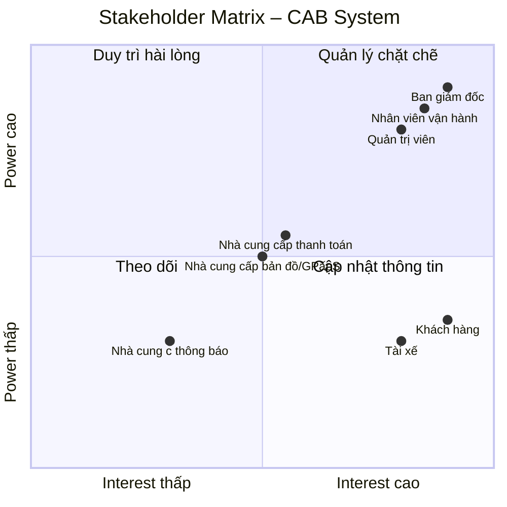

Stakeholder chính:

Ban giám đốc
Khách hàng
Tài xế
Nhân viên vận hành
Quản trị viên

# Stakeholder – CAB System

| Tên stakeholder | Vai trò stakeholder chính |
|---|---|
| **Ban giám đốc Công ty ABC** | Định hướng dự án, xác định mục tiêu và yêu cầu kinh doanh; theo dõi các báo cáo về số lượng chuyến, doanh thu, tỷ lệ hoàn thành, tỷ lệ hủy và hiệu quả hoạt động của tài xế. |
| **Khách hàng** | Đăng ký tài khoản, đặt xe, theo dõi chuyến đi, thanh toán, xem lịch sử chuyến và đánh giá tài xế. |
| **Tài xế** | Quản lý hồ sơ, phương tiện và trạng thái hoạt động; nhận và thực hiện chuyến, cập nhật trạng thái và vị trí. |
| **Nhân viên vận hành** | Quản lý khách hàng, tài xế, phương tiện và chuyến đi; theo dõi các chuyến đang diễn ra và hỗ trợ xử lý các trường hợp chuyến bị lỗi. |
| **Quản trị viên hệ thống** | Quản lý tài khoản, phân quyền và kiểm soát các thao tác quản trị nhạy cảm trên hệ thống. |
| **Nhà cung cấp dịch vụ thanh toán** | Xử lý các giao dịch thanh toán điện tử cho khách hàng thông qua hệ thống CAB. |
| **Nhà cung cấp dịch vụ bản đồ/GPS** | Cung cấp thông tin vị trí, khoảng cách và hỗ trợ tìm tài xế gần khách hàng, dự kiến thời gian tài xế đến. |
| **Nhà cung cấp dịch vụ thông báo** | Cung cấp các kênh gửi thông báo đến khách hàng và tài xế về trạng thái chuyến đi, thanh toán và các thay đổi liên quan. |


# Stakeholder Matrix – CAB System

| Stakeholder | Power | Interest | Chiến lược quản lý |
|---|---|---|---|
| **Ban giám đốc Công ty ABC** | Cao | Cao | Quản lý chặt chẽ; thường xuyên trao đổi, báo cáo tiến độ và xác nhận các quyết định quan trọng. |
| **Khách hàng** | Thấp | Cao | Thường xuyên cập nhật và thu thập phản hồi để đảm bảo hệ thống đáp ứng nhu cầu sử dụng. |
| **Tài xế** | Thấp | Cao | Thường xuyên trao đổi và thu thập phản hồi về quy trình nhận, thực hiện và hoàn thành chuyến. |
| **Nhân viên vận hành** | Cao | Cao | Quản lý chặt chẽ; tham gia phân tích nghiệp vụ, kiểm thử và xác nhận các quy trình vận hành. |
| **Quản trị viên hệ thống** | Cao | Cao | Quản lý chặt chẽ; tham gia xác định yêu cầu về tài khoản, phân quyền và bảo mật. |
| **Nhà cung cấp dịch vụ thanh toán** | Trung bình | Trung bình | Duy trì quan hệ và phối hợp khi tích hợp, xử lý giao dịch hoặc sự cố thanh toán. |
| **Nhà cung cấp dịch vụ bản đồ/GPS** | Trung bình | Trung bình | Duy trì quan hệ; phối hợp về dữ liệu vị trí, khoảng cách và dịch vụ bản đồ. |
| **Nhà cung cấp dịch vụ thông báo** | Trung bình | Thấp | Theo dõi và cung cấp thông tin cần thiết khi tích hợp hoặc xử lý sự cố thông báo. |


## Stakeholder Matrix – CAB System

### Power – Interest Matrix


# Business Rules – CAB System MVP

## 1. Quy tắc tài khoản và phân quyền

| Mã | Business Rule |
|---|---|
| **BR-01** | Khách hàng và tài xế phải được xác thực trước khi sử dụng các chức năng yêu cầu tài khoản. |
| **BR-02** | Chỉ người dùng có quyền phù hợp mới được thực hiện các thao tác quản trị. |
| **BR-03** | Thông tin cá nhân của khách hàng và tài xế phải được bảo vệ. |

## 2. Quy tắc đặt xe

| Mã | Business Rule |
|---|---|
| **BR-04** | Một yêu cầu đặt xe phải có điểm đón, điểm đến và loại xe. |
| **BR-05** | Sau khi khách hàng gửi yêu cầu, hệ thống phải chuyển yêu cầu sang trạng thái tìm tài xế. |
| **BR-06** | Khách hàng phải được thông báo về trạng thái xử lý yêu cầu đặt xe. |

## 3. Quy tắc tìm và phân công tài xế

| Mã | Business Rule |
|---|---|
| **BR-07** | Hệ thống chỉ xem xét các tài xế đang ở trạng thái sẵn sàng nhận chuyến. |
| **BR-08** | Tài xế được lựa chọn phải phù hợp với loại xe mà khách hàng yêu cầu. |
| **BR-09** | Hệ thống phải ưu tiên tài xế phù hợp và gần điểm đón của khách hàng. |
| **BR-10** | Nếu tài xế được đề xuất không phản hồi hoặc từ chối chuyến, hệ thống phải tiếp tục tìm tài xế khác. |
| **BR-11** | Nếu không tìm được tài xế phù hợp, hệ thống phải thông báo cho khách hàng. |
| **BR-12** | Khi tài xế chấp nhận chuyến, hệ thống phải ghi nhận tài xế được phân công cho chuyến đó. |

## 4. Quy tắc thực hiện chuyến

| Mã | Business Rule |
|---|---|
| **BR-13** | Tài xế phải cập nhật trạng thái chuyến trong quá trình thực hiện. |
| **BR-14** | Các trạng thái chính của chuyến gồm: tìm tài xế, đã phân công tài xế, tài xế đến điểm đón, đã đón khách, đang di chuyển và hoàn thành. |
| **BR-15** | Khi chuyến hoàn thành, hệ thống phải ghi nhận thông tin chuyến để phục vụ tính cước, thanh toán và lưu lịch sử. |
| **BR-16** | Hệ thống phải lưu thông tin vị trí của tài xế để hỗ trợ tìm tài xế và dự kiến thời gian đến. |

## 5. Quy tắc tính cước và thanh toán

| Mã | Business Rule |
|---|---|
| **BR-17** | Sau khi chuyến hoàn thành, hệ thống phải xác định số tiền khách hàng phải trả dựa trên loại dịch vụ và thông tin chuyến đi. |
| **BR-18** | Khách hàng được phép thanh toán bằng tiền mặt hoặc phương thức thanh toán điện tử được hệ thống hỗ trợ. |
| **BR-19** | Thông tin nhạy cảm của thẻ hoặc tài khoản thanh toán không được lưu trực tiếp trong hệ thống CAB. |
| **BR-20** | Thanh toán điện tử phải được xử lý thông qua nhà cung cấp dịch vụ thanh toán bên ngoài. |
| **BR-21** | Khi thanh toán điện tử thất bại, hệ thống phải thông báo cho khách hàng và cho phép xử lý lại theo chính sách của doanh nghiệp. |

## 6. Quy tắc thông báo

| Mã | Business Rule |
|---|---|
| **BR-22** | Khách hàng phải được thông báo khi yêu cầu đặt xe được tiếp nhận. |
| **BR-23** | Khách hàng phải được thông báo khi tài xế nhận chuyến. |
| **BR-24** | Khách hàng phải được thông báo khi tài xế đến điểm đón. |
| **BR-25** | Khách hàng phải được thông báo khi chuyến xe hoàn thành và khi thanh toán có kết quả. |
| **BR-26** | Tài xế phải được thông báo khi có chuyến mới hoặc có thay đổi liên quan đến chuyến đang thực hiện. |

## 7. Quy tắc vận hành

| Mã | Business Rule |
|---|---|
| **BR-27** | Nhân viên vận hành được phép theo dõi các chuyến đang diễn ra và trạng thái tài xế theo quyền được cấp. |
| **BR-28** | Nhân viên vận hành được phép hỗ trợ xử lý các trường hợp chuyến bị lỗi theo chính sách của doanh nghiệp. |
| **BR-29** | Các thao tác quản trị quan trọng phải được lưu vết để phục vụ kiểm tra và xử lý sự cố. |
---

# Business Rules cần xác nhận

Các quy tắc dưới đây chưa được xác định cụ thể trong yêu cầu hiện tại. Cần trao đổi với khách hàng hoặc Ban giám đốc trước khi triển khai chính thức.

| Mã | Nội dung cần xác nhận |
|---|---|
| **BR-Q01** | Bán kính tối đa để hệ thống tìm kiếm tài xế là bao nhiêu? |
| **BR-Q02** | Tài xế có bao nhiêu thời gian để phản hồi yêu cầu chuyến? |
| **BR-Q03** | Sau khi tài xế từ chối hoặc không phản hồi, hệ thống chuyển sang tài xế tiếp theo sau bao lâu? |
| **BR-Q04** | Ngoài khoảng cách, hệ thống có tiêu chí nào khác để ưu tiên tài xế không? |
| **BR-Q05** | Công thức tính cước chuyến xe cụ thể là gì? |
| **BR-Q06** | Có áp dụng phụ phí theo thời điểm, quãng đường, loại xe hoặc điều kiện khác không? |
| **BR-Q07** | Khách hàng có được phép hủy chuyến không và có phát sinh phí hủy không? |
| **BR-Q08** | Nếu tài xế hủy chuyến sau khi đã nhận, hệ thống có tự động tìm tài xế khác không? |
| **BR-Q09** | Khi thanh toán điện tử thất bại, khách hàng được phép thanh toán lại bao nhiêu lần? |
| **BR-Q10** | Khi mất kết nối mạng hoặc GPS, hệ thống xử lý trạng thái chuyến và vị trí tài xế như thế nào? |

---

# Tổng kết Business Rules

| Loại | Số lượng | Phạm vi |
|---|---:|---|
| Business Rules chính thức | **29** | Sử dụng cho MVP |
| Business Rules cần xác nhận | **10** | Cần thống nhất với khách hàng |
| **Tổng cộng** | **39** | Bao gồm cả nội dung cần xác nhận |

> **Lưu ý:** BR-Q01 đến BR-Q10 chưa được xem là Business Rule chính thức của hệ thống. Sau khi khách hàng xác nhận, các nội dung này mới được chuẩn hóa thành Business Rule chính thức và đánh số lại nếu cần.
>
BUOC 4
# Business Rules – CAB System MVP

## 1. Phạm vi phát triển MVP

MVP của CAB System tập trung vào hai module chính:

* **Quản lý khách hàng**
* **Quản lý tài xế**

Mục tiêu của MVP là xây dựng được luồng đặt xe cơ bản và đảm bảo hệ thống có thể vận hành một chuyến xe từ khi khách hàng gửi yêu cầu đến khi chuyến xe hoàn thành.

Trong giai đoạn MVP, hệ thống **chưa yêu cầu thuật toán lựa chọn tài xế tốt nhất**. Hệ thống chỉ cần tìm một tài xế **phù hợp với loại xe và đang sẵn sàng nhận chuyến**.

---

# 2. Business Rules áp dụng cho MVP

## 2.1. Quản lý khách hàng

| Mã        | Business Rule                                                                              |
| --------- | ------------------------------------------------------------------------------------------ |
| **BR-01** | Khách hàng và tài xế phải được xác thực trước khi sử dụng các chức năng yêu cầu tài khoản. |
| **BR-03** | Thông tin cá nhân của khách hàng và tài xế phải được bảo vệ.                               |
| **BR-04** | Một yêu cầu đặt xe phải có điểm đón, điểm đến và loại xe.                                  |
| **BR-05** | Sau khi khách hàng gửi yêu cầu, hệ thống phải chuyển yêu cầu sang trạng thái tìm tài xế.   |
| **BR-06** | Khách hàng phải được thông báo về trạng thái xử lý yêu cầu đặt xe.                         |
| **BR-15** | Khi chuyến hoàn thành, hệ thống phải ghi nhận thông tin chuyến để phục vụ lưu lịch sử.     |
| **BR-22** | Khách hàng phải được thông báo khi yêu cầu đặt xe được tiếp nhận.                          |
| **BR-23** | Khách hàng phải được thông báo khi tài xế nhận chuyến.                                     |
| **BR-24** | Khách hàng phải được thông báo khi tài xế đến điểm đón.                                    |
| **BR-25** | Khách hàng phải được thông báo khi chuyến xe hoàn thành.                                   |

---

## 2.2. Quản lý tài xế

| Mã        | Business Rule                                                                                                                          |
| --------- | -------------------------------------------------------------------------------------------------------------------------------------- |
| **BR-01** | Khách hàng và tài xế phải được xác thực trước khi sử dụng các chức năng yêu cầu tài khoản.                                             |
| **BR-03** | Thông tin cá nhân của khách hàng và tài xế phải được bảo vệ.                                                                           |
| **BR-07** | Hệ thống chỉ xem xét các tài xế đang ở trạng thái sẵn sàng nhận chuyến.                                                                |
| **BR-08** | Tài xế được lựa chọn phải phù hợp với loại xe mà khách hàng yêu cầu.                                                                   |
| **BR-10** | Nếu tài xế được đề xuất không phản hồi hoặc từ chối chuyến, hệ thống phải tiếp tục tìm tài xế khác.                                    |
| **BR-12** | Khi tài xế chấp nhận chuyến, hệ thống phải ghi nhận tài xế được phân công cho chuyến đó.                                               |
| **BR-13** | Tài xế phải cập nhật trạng thái chuyến trong quá trình thực hiện.                                                                      |
| **BR-14** | Các trạng thái chính của chuyến gồm: tìm tài xế, đã phân công tài xế, tài xế đến điểm đón, đã đón khách, đang di chuyển và hoàn thành. |
| **BR-16** | Hệ thống phải lưu thông tin vị trí của tài xế để hỗ trợ tìm tài xế và dự kiến thời gian đến.                                           |
| **BR-26** | Tài xế phải được thông báo khi có chuyến mới hoặc có thay đổi liên quan đến chuyến đang thực hiện.                                     |

---

# 3. Quy tắc tìm tài xế trong MVP

Để giới hạn phạm vi phát triển, chức năng tìm tài xế chỉ thực hiện ở mức cơ bản.

| Mã            | Business Rule                                                                                               |
| ------------- | ----------------------------------------------------------------------------------------------------------- |
| **BR-MVP-01** | Hệ thống chỉ tìm tài xế đang ở trạng thái sẵn sàng nhận chuyến.                                             |
| **BR-MVP-02** | Tài xế được chọn phải phù hợp với loại xe khách hàng yêu cầu.                                               |
| **BR-MVP-03** | Hệ thống chỉ cần tìm được một tài xế phù hợp để tiếp tục chuyến xe, không yêu cầu lựa chọn tài xế tốt nhất. |
| **BR-MVP-04** | Nếu tài xế từ chối hoặc không phản hồi, hệ thống có thể tiếp tục gửi yêu cầu đến tài xế phù hợp khác.       |
| **BR-MVP-05** | Nếu không tìm được tài xế, hệ thống phải thông báo cho khách hàng.                                          |

> **Lưu ý:** Các BR-MVP-01 đến BR-MVP-05 là cách cụ thể hóa các BR-07, BR-08, BR-10, BR-11 và phạm vi MVP. Không phát triển thuật toán xếp hạng hoặc tối ưu tài xế trong giai đoạn này.

---

# 4. Luồng nghiệp vụ tối thiểu của MVP

MVP phải đảm bảo được luồng nghiệp vụ sau:

```text
Khách hàng đăng nhập
        ↓
Nhập điểm đón + điểm đến + loại xe
        ↓
Gửi yêu cầu đặt xe
        ↓
Hệ thống tìm tài xế phù hợp
        ↓
Có tài xế?
   ┌────┴────┐
   │         │
  Có        Không
   │         │
   ↓         ↓
Tài xế     Thông báo
nhận chuyến không tìm thấy tài xế
   │
   ↓
Tài xế đến điểm đón
   ↓
Đã đón khách
   ↓
Đang di chuyển
   ↓
Hoàn thành chuyến
   ↓
Lưu lịch sử chuyến
```

---

# 5. Các Business Rules chưa triển khai trong MVP

Các quy tắc sau được giữ lại cho các giai đoạn tiếp theo:

| Mã        | Business Rule                                                                               | Giai đoạn |
| --------- | ------------------------------------------------------------------------------------------- | --------- |
| **BR-02** | Chỉ người dùng có quyền phù hợp mới được thực hiện các thao tác quản trị.                   | Sau MVP   |
| **BR-09** | Hệ thống phải ưu tiên tài xế phù hợp và gần điểm đón của khách hàng.                        | Sau MVP   |
| **BR-17** | Hệ thống xác định số tiền khách hàng phải trả dựa trên loại dịch vụ và thông tin chuyến đi. | Sau MVP   |
| **BR-18** | Thanh toán bằng tiền mặt hoặc phương thức thanh toán điện tử.                               | Sau MVP   |
| **BR-19** | Không lưu thông tin nhạy cảm của thẻ hoặc tài khoản thanh toán trực tiếp trên CAB.          | Sau MVP   |
| **BR-20** | Thanh toán điện tử thông qua nhà cung cấp bên ngoài.                                        | Sau MVP   |
| **BR-21** | Xử lý trường hợp thanh toán điện tử thất bại.                                               | Sau MVP   |
| **BR-27** | Nhân viên vận hành theo dõi chuyến đang diễn ra và trạng thái tài xế.                       | Sau MVP   |
| **BR-28** | Nhân viên vận hành hỗ trợ xử lý chuyến bị lỗi.                                              | Sau MVP   |
| **BR-29** | Lưu vết các thao tác quản trị quan trọng.                                                   | Sau MVP   |

---

# 6. Tổng kết phạm vi MVP

| Nội dung                     | Trạng thái          |
| ---------------------------- | ------------------- |
| Quản lý khách hàng           | **MVP**             |
| Quản lý tài xế               | **MVP**             |
| Đăng ký / đăng nhập          | **MVP**             |
| Quản lý thông tin khách hàng | **MVP**             |
| Quản lý thông tin tài xế     | **MVP**             |
| Đặt xe                       | **MVP**             |
| Tìm tài xế cơ bản            | **MVP**             |
| Tối ưu tài xế tốt nhất       | **Không thuộc MVP** |
| Phân công tài xế             | **MVP**             |
| Cập nhật trạng thái chuyến   | **MVP**             |
| Theo dõi chuyến              | **MVP**             |
| Thông báo cơ bản             | **MVP**             |
| Lịch sử chuyến               | **MVP**             |
| Tính cước nâng cao           | **Sau MVP**         |
| Thanh toán điện tử           | **Sau MVP**         |
| Báo cáo vận hành             | **Sau MVP**         |
| Phân tích hiệu suất tài xế   | **Sau MVP**         |

---

## Kết luận

**MVP không cần triển khai toàn bộ 29 Business Rules ban đầu.**

Phạm vi phát triển giai đoạn này chỉ tập trung vào:

> **Quản lý khách hàng + Quản lý tài xế + luồng đặt và thực hiện chuyến cơ bản.**

Trong đó chức năng tìm tài xế chỉ cần đáp ứng:

> **Có tài xế phù hợp → gửi yêu cầu → tài xế nhận → thực hiện chuyến.**

Chưa cần:

> **xếp hạng → tính điểm → tối ưu khoảng cách → chọn tài xế tốt nhất → thuật toán dispatch nâng cao.**

# Business Requirements – CAB System MVP

## 1. Phạm vi MVP

Trong giai đoạn MVP, CAB System tập trung phát triển hai module:

* **Quản lý khách hàng**
* **Quản lý tài xế**

Mục tiêu của MVP là xây dựng được quy trình đặt và thực hiện chuyến xe cơ bản.

Hệ thống chưa tập trung vào việc tìm kiếm và lựa chọn **tài xế tốt nhất**. Chỉ cần hệ thống tìm được một tài xế phù hợp và đang sẵn sàng nhận chuyến để hoàn thành quy trình đặt xe.

---

# 2. Business Requirements – Quản lý khách hàng

| Mã        | Business Requirement                                                                              |
| --------- | ------------------------------------------------------------------------------------------------- |
| **BR-01** | Hệ thống phải cho phép khách hàng đăng ký tài khoản.                                              |
| **BR-02** | Hệ thống phải cho phép khách hàng đăng nhập vào hệ thống.                                         |
| **BR-03** | Hệ thống phải cho phép khách hàng xem và cập nhật thông tin cá nhân.                              |
| **BR-04** | Hệ thống phải cho phép khách hàng nhập điểm đón khi đặt xe.                                       |
| **BR-05** | Hệ thống phải cho phép khách hàng nhập điểm đến khi đặt xe.                                       |
| **BR-06** | Hệ thống phải cho phép khách hàng lựa chọn loại xe khi đặt xe.                                    |
| **BR-07** | Hệ thống phải cho phép khách hàng gửi yêu cầu đặt xe sau khi cung cấp đầy đủ thông tin chuyến đi. |
| **BR-08** | Hệ thống phải cho phép khách hàng theo dõi trạng thái xử lý yêu cầu đặt xe.                       |
| **BR-09** | Hệ thống phải hiển thị thông tin tài xế được phân công cho khách hàng khi có tài xế nhận chuyến.  |
| **BR-10** | Hệ thống phải cho phép khách hàng theo dõi trạng thái chuyến xe.                                  |
| **BR-11** | Hệ thống phải cho phép khách hàng xem lịch sử các chuyến xe đã hoàn thành.                        |

---

# 3. Business Requirements – Quản lý tài xế

| Mã        | Business Requirement                                                                          |
| --------- | --------------------------------------------------------------------------------------------- |
| **BR-12** | Hệ thống phải cho phép tài xế đăng nhập vào hệ thống.                                         |
| **BR-13** | Hệ thống phải cho phép tài xế xem và cập nhật thông tin cá nhân.                              |
| **BR-14** | Hệ thống phải cho phép tài xế xem và cập nhật thông tin phương tiện.                          |
| **BR-15** | Hệ thống phải cho phép tài xế chuyển đổi trạng thái sẵn sàng hoặc không sẵn sàng nhận chuyến. |
| **BR-16** | Hệ thống phải gửi thông báo cho tài xế khi có yêu cầu chuyến xe phù hợp.                      |
| **BR-17** | Hệ thống phải cho phép tài xế chấp nhận hoặc từ chối yêu cầu chuyến xe.                       |
| **BR-18** | Hệ thống phải ghi nhận tài xế được phân công khi tài xế chấp nhận chuyến.                     |
| **BR-19** | Hệ thống phải cho phép tài xế cập nhật trạng thái chuyến xe trong quá trình thực hiện.        |
| **BR-20** | Hệ thống phải ghi nhận vị trí của tài xế trong quá trình phục vụ chuyến xe.                   |

---

# 4. Business Requirements – Đặt và phân công chuyến xe

Đây là các yêu cầu nghiệp vụ cần thiết để hai module **Quản lý khách hàng** và **Quản lý tài xế** có thể hoạt động cùng nhau.

| Mã        | Business Requirement                                                                            |
| --------- | ----------------------------------------------------------------------------------------------- |
| **BR-21** | Hệ thống phải tìm kiếm các tài xế đang sẵn sàng nhận chuyến.                                    |
| **BR-22** | Hệ thống phải chỉ gửi yêu cầu đến tài xế có loại xe phù hợp với loại xe khách hàng đã lựa chọn. |
| **BR-23** | Hệ thống phải phân công chuyến cho tài xế khi tài xế chấp nhận yêu cầu.                         |
| **BR-24** | Nếu tài xế từ chối yêu cầu, hệ thống phải tiếp tục tìm tài xế phù hợp khác.                     |
| **BR-25** | Nếu không có tài xế phù hợp, hệ thống phải thông báo cho khách hàng.                            |
| **BR-26** | Hệ thống phải quản lý trạng thái chuyến xe từ khi tìm tài xế đến khi chuyến hoàn thành.         |

---

# 5. Các trạng thái chuyến xe trong MVP

Trong MVP, hệ thống quản lý các trạng thái cơ bản:

```text
Tìm tài xế
     ↓
Đã phân công tài xế
     ↓
Tài xế đến điểm đón
     ↓
Đã đón khách
     ↓
Đang di chuyển
     ↓
Hoàn thành
```

Tài xế có trách nhiệm cập nhật trạng thái chuyến trong quá trình thực hiện.

---

# 6. Giới hạn MVP

## 6.1. Có trong MVP

| Chức năng                    | MVP   |
| ---------------------------- | ----- |
| Đăng ký khách hàng           | ✅     |
| Đăng nhập khách hàng         | ✅     |
| Quản lý thông tin khách hàng | ✅     |
| Nhập điểm đón                | ✅     |
| Nhập điểm đến                | ✅     |
| **Lựa chọn loại xe**         | **✅** |
| Gửi yêu cầu đặt xe           | ✅     |
| Tìm tài xế cơ bản            | ✅     |
| Tài xế online/offline        | ✅     |
| Tài xế nhận/từ chối chuyến   | ✅     |
| Phân công tài xế             | ✅     |
| Cập nhật trạng thái chuyến   | ✅     |
| Theo dõi trạng thái chuyến   | ✅     |
| Xem thông tin tài xế         | ✅     |
| Lưu lịch sử chuyến           | ✅     |

## 6.2. Chưa có trong MVP

| Chức năng                            | Trạng thái |
| ------------------------------------ | ---------- |
| Tìm tài xế tốt nhất                  | ❌          |
| Xếp hạng tài xế                      | ❌          |
| Tối ưu khoảng cách giữa nhiều tài xế | ❌          |
| Thuật toán điều phối nâng cao        | ❌          |
| Tính giá động                        | ❌          |
| Khuyến mãi/voucher                   | ❌          |
| Ví điện tử                           | ❌          |
| Chat khách hàng – tài xế             | ❌          |
| Đặt xe trước theo lịch               | ❌          |
| Nhiều điểm đón/trả                   | ❌          |
| Báo cáo phân tích tài xế nâng cao    | ❌          |

---

# 7. Mối quan hệ giữa Business Requirements và Module MVP

| Module                         | Business Requirements chính |
| ------------------------------ | --------------------------- |
| **Quản lý khách hàng**         | BR-01 → BR-11               |
| **Quản lý tài xế**             | BR-12 → BR-20               |
| **Đặt và phân công chuyến xe** | BR-21 → BR-26               |

### Luồng MVP tổng quát

```text
                 CAB SYSTEM MVP
                       │
          ┌────────────┴────────────┐
          │                         │
   Quản lý khách hàng        Quản lý tài xế
          │                         │
          │                         │
          └────── Đặt chuyến ───────┘
                       │
                       ↓
                Tìm tài xế cơ bản
                       │
              ┌────────┴────────┐
              │                 │
          Có tài xế         Không có
              │                 │
              ↓                 ↓
       Tài xế nhận chuyến    Thông báo KH
              │
              ↓
       Thực hiện chuyến
              │
              ↓
          Hoàn thành
              │
              ↓
        Lưu lịch sử chuyến
```

---

# Business – Business Requirement (BR) – CAB System MVP

| Business | Business Requirement (BR) |
|---|---|
| **B1. Doanh nghiệp cần quản lý thông tin khách hàng** | **BR-01:** Hệ thống phải cho phép khách hàng đăng ký tài khoản. |
| | **BR-02:** Hệ thống phải cho phép khách hàng đăng nhập. |
| | **BR-03:** Hệ thống phải cho phép khách hàng xem và cập nhật thông tin cá nhân. |
| **B2. Doanh nghiệp cần khách hàng có thể gửi yêu cầu đặt xe** | **BR-04:** Hệ thống phải cho phép khách hàng nhập điểm đón và điểm đến. |
| | **BR-05:** Hệ thống phải cho phép khách hàng lựa chọn loại xe phù hợp với nhu cầu. |
| | **BR-06:** Hệ thống phải cho phép khách hàng gửi yêu cầu đặt xe sau khi nhập đầy đủ thông tin. |
| **B3. Doanh nghiệp cần quản lý thông tin tài xế** | **BR-07:** Hệ thống phải cho phép quản lý thông tin tài xế. |
| | **BR-08:** Hệ thống phải cho phép quản lý thông tin phương tiện của tài xế. |
| | **BR-09:** Hệ thống phải cho phép tài xế đăng nhập và sử dụng hệ thống. |
| **B4. Doanh nghiệp cần biết tài xế nào đang có thể nhận chuyến** | **BR-10:** Hệ thống phải cho phép tài xế cập nhật trạng thái sẵn sàng hoặc không sẵn sàng nhận chuyến. |
| **B5. Doanh nghiệp cần phân công tài xế cho yêu cầu đặt xe** | **BR-11:** Hệ thống phải tìm tài xế đang sẵn sàng và phù hợp với loại xe khách hàng lựa chọn. |
| | **BR-12:** Hệ thống phải gửi yêu cầu chuyến xe đến tài xế phù hợp. |
| | **BR-13:** Hệ thống phải ghi nhận tài xế khi tài xế chấp nhận chuyến. |
| **B6. Doanh nghiệp cần chuyến xe được thực hiện trên hệ thống** | **BR-14:** Hệ thống phải cho phép tài xế cập nhật trạng thái chuyến xe. |
| | **BR-15:** Hệ thống phải quản lý trạng thái chuyến từ khi phân công tài xế đến khi hoàn thành. |
| **B7. Doanh nghiệp cần khách hàng biết tình trạng chuyến xe** | **BR-16:** Hệ thống phải cho phép khách hàng theo dõi trạng thái chuyến xe. |
| | **BR-17:** Hệ thống phải hiển thị thông tin tài xế được phân công cho khách hàng. |
| **B8. Doanh nghiệp cần xử lý trường hợp tài xế không nhận chuyến** | **BR-18:** Nếu tài xế từ chối hoặc không phản hồi, hệ thống phải tiếp tục tìm tài xế phù hợp khác. |
| | **BR-19:** Nếu không tìm được tài xế, hệ thống phải thông báo cho khách hàng. |
| **B9. Doanh nghiệp cần lưu lại thông tin chuyến xe** | **BR-20:** Hệ thống phải lưu thông tin các chuyến xe đã hoàn thành để phục vụ tra cứu lịch sử. |

BUSINESS
│
├── B1. Quản lý khách hàng
│   ├── BR-01 Đăng ký
│   ├── BR-02 Đăng nhập
│   └── BR-03 Cập nhật thông tin
│
├── B2. Đặt xe
│   ├── BR-04 Nhập điểm đón/điểm đến
│   ├── BR-05 Lựa chọn loại xe
│   └── BR-06 Gửi yêu cầu đặt xe
│
├── B3. Quản lý tài xế
│   ├── BR-07 Quản lý thông tin tài xế
│   ├── BR-08 Quản lý phương tiện
│   └── BR-09 Đăng nhập
│
├── B4. Trạng thái tài xế
│   └── BR-10 Sẵn sàng/Không sẵn sàng
│
├── B5. Phân công tài xế
│   ├── BR-11 Tìm tài xế phù hợp
│   ├── BR-12 Gửi yêu cầu chuyến
│   └── BR-13 Ghi nhận tài xế
│
├── B6. Thực hiện chuyến
│   ├── BR-14 Cập nhật trạng thái
│   └── BR-15 Quản lý trạng thái chuyến
│
├── B7. Theo dõi chuyến
│   ├── BR-16 Theo dõi trạng thái
│   └── BR-17 Xem thông tin tài xế
│
├── B8. Xử lý không có tài xế
│   ├── BR-18 Tìm tài xế khác
│   └── BR-19 Thông báo không có tài xế
│
└── B9. Lịch sử
    └── BR-20 Lưu lịch sử chuyến

**Khách hàng lựa chọn xe → gửi yêu cầu → hệ thống tìm tài xế phù hợp → tài xế nhận chuyến → thực hiện chuyến → hoàn thành.**

Trong giai đoạn này, hệ thống **không yêu cầu lựa chọn tài xế tốt nhất**, mà chỉ cần tìm được **một tài xế phù hợp và sẵn sàng** để đảm bảo quy trình đặt xe hoạt động.
# BUSINESS PROCESS MODELING – CAB SYSTEM MVP

## 1. Mục đích

Business Process Modeling được xây dựng dựa trên các Business Requirement (BR) đã xác định nhằm mô tả cách các hoạt động nghiệp vụ diễn ra trong hệ thống CAB System.

Trong phạm vi MVP, hệ thống tập trung vào hai module chính:

- Quản lý khách hàng
- Quản lý tài xế

Quy trình nghiệp vụ trọng tâm là quy trình từ khi khách hàng đăng nhập, tạo yêu cầu đặt xe, hệ thống tìm tài xế phù hợp, tài xế tiếp nhận chuyến, thực hiện chuyến và lưu lại thông tin chuyến xe.

---

# 2. Các quy trình nghiệp vụ

Dựa trên các Business Requirement, hệ thống được mô hình hóa thành các quy trình nghiệp vụ chính sau:

| Mã quy trình | Tên quy trình | Business Requirement liên quan |
|---|---|---|
| **BP-01** | Đăng ký và quản lý thông tin khách hàng | BR-01, BR-02, BR-03 |
| **BP-02** | Đặt xe và phân công tài xế | BR-04, BR-05, BR-06, BR-10, BR-11, BR-12, BR-13, BR-18, BR-19 |
| **BP-03** | Thực hiện và theo dõi chuyến xe | BR-14, BR-15, BR-16, BR-17, BR-20 |

---

# 3. Business Process BP-01 – Đăng ký và quản lý thông tin khách hàng

## 3.1. Mục đích

Cho phép khách hàng tạo tài khoản, đăng nhập và cập nhật thông tin cá nhân để sử dụng dịch vụ đặt xe.

## 3.2. Business Requirement liên quan

- **BR-01:** Hệ thống phải cho phép khách hàng đăng ký tài khoản.
- **BR-02:** Hệ thống phải cho phép khách hàng đăng nhập.
- **BR-03:** Hệ thống phải cho phép khách hàng xem và cập nhật thông tin cá nhân.

## 3.3. Quy trình

1. Khách hàng chọn chức năng đăng ký hoặc đăng nhập.
2. Nếu chưa có tài khoản, khách hàng nhập thông tin đăng ký.
3. Hệ thống kiểm tra thông tin đăng ký.
4. Nếu thông tin hợp lệ, hệ thống tạo tài khoản cho khách hàng.
5. Khách hàng đăng nhập vào hệ thống.
6. Hệ thống xác thực thông tin đăng nhập.
7. Khách hàng có thể xem và cập nhật thông tin cá nhân.
8. Hệ thống lưu thông tin đã cập nhật.

## 3.4. Mô hình quy trình

```mermaid
flowchart TD
    A([Bắt đầu]) --> B[Đăng ký / Đăng nhập]

    B --> C{Đã có tài khoản?}

    C -->|Chưa| D[Nhập thông tin đăng ký]
    D --> E[Kiểm tra thông tin]
    E --> F{Thông tin hợp lệ?}

    F -->|Không| D
    F -->|Có| G[Tạo tài khoản]

    C -->|Có| H[Nhập thông tin đăng nhập]
    G --> H

    H --> I[Xác thực tài khoản]
    I --> J{Đăng nhập thành công?}

    J -->|Không| H
    J -->|Có| K[Xem / cập nhật thông tin cá nhân]

    K --> L[Lưu thông tin]
    L --> M([Kết thúc])
