# 23670421_LeHieuNghia_CABSYSTEM
# CAB SYSTEM – PHÂN TÍCH NGHIỆP VỤ MVP

## Thông tin dự án

**Tên dự án:** CAB System – Nền tảng đặt xe
**Doanh nghiệp:** Công ty ABC
**Thời gian xây dựng và triển khai:** 7 tuần

---

# 0. YÊU CẦU KHÁCH HÀNG

Công ty ABC là doanh nghiệp cung cấp dịch vụ đặt xe trực tuyến. Hiện tại khách hàng có thể liên hệ tổng đài hoặc sử dụng ứng dụng đơn giản để yêu cầu xe.

Hệ thống hiện tại còn các hạn chế:

- Việc phân công tài xế chủ yếu được thực hiện thủ công.
- Khách hàng khó theo dõi trạng thái chuyến đi.
- Thông tin thanh toán chưa được quản lý tập trung.
- Bộ phận vận hành khó mở rộng hệ thống.
- Khả năng tích hợp và mở rộng tính năng còn hạn chế.

Ban giám đốc mong muốn xây dựng một nền tảng CAB mới có khả năng:

- Phục vụ nhiều khách hàng và tài xế.
- Hỗ trợ đặt xe trực tuyến.
- Quản lý khách hàng.
- Quản lý tài xế.
- Tìm và phân công tài xế.
- Theo dõi trạng thái chuyến.
- Có kiến trúc có thể mở rộng trong tương lai.

## 0.1. Yêu cầu đối với khách hàng

Khách hàng cần:

1. Đăng ký tài khoản.
2. Đăng nhập.
3. Cập nhật thông tin cá nhân.
4. Nhập điểm đón.
5. Nhập điểm đến.
6. Lựa chọn loại xe.
7. Gửi yêu cầu đặt xe.
8. Biết hệ thống đang tìm tài xế.
9. Biết tài xế nào đã nhận chuyến.
10. Biết thời gian dự kiến tài xế đến (ETA). *(bổ sung — có trong yêu cầu gốc, bị thiếu ở bản trước)*
11. Theo dõi trạng thái chuyến.
12. Xem lịch sử chuyến.
13. Biết số tiền phải trả.
14. Đánh giá tài xế sau chuyến.

## 0.2. Yêu cầu đối với tài xế

Tài xế cần:

1. Đăng ký hoặc được tạo tài khoản.
2. Đăng nhập.
3. Cập nhật hồ sơ.
4. Cập nhật thông tin phương tiện.
5. Chuyển trạng thái sẵn sàng.
6. Nhận thông báo khi có chuyến.
7. Chấp nhận hoặc từ chối chuyến.
8. Cập nhật trạng thái chuyến.
9. Cập nhật vị trí.

## 0.3. Yêu cầu tìm tài xế

Hệ thống phải:

1. Tìm tài xế phù hợp.
2. Ưu tiên tài xế phù hợp và gần khách hàng.
3. Xử lý khi tài xế không phản hồi.
4. Xử lý khi tài xế từ chối.
5. Tiếp tục tìm tài xế khác.
6. Thông báo cho khách hàng nếu không tìm được tài xế.

## 0.4. Yêu cầu thanh toán

Sau khi chuyến hoàn thành:

- Hệ thống xác định số tiền phải trả dựa trên loại dịch vụ và thông tin chuyến đi.
- Khách hàng có thể thanh toán tiền mặt.
- Khách hàng có thể thanh toán điện tử.
- Thanh toán điện tử thông qua nhà cung cấp bên ngoài.
- Không lưu thông tin nhạy cảm của thẻ/tài khoản thanh toán trên CAB.
- Nếu thanh toán thất bại, khách hàng được thông báo và có thể xử lý lại theo chính sách.

## 0.5. Yêu cầu thông báo

Khách hàng được thông báo khi:

- Yêu cầu được tiếp nhận.
- Tài xế nhận chuyến.
- Tài xế đến điểm đón.
- Chuyến hoàn thành.
- Thanh toán có kết quả.

Tài xế được thông báo khi:

- Có chuyến mới.
- Có thay đổi liên quan đến chuyến đang thực hiện.

Doanh nghiệp muốn có khả năng **mở rộng thêm kênh thông báo** (SMS, email, push, v.v.) trong tương lai mà không phải thay đổi toàn bộ hệ thống.

## 0.6. Yêu cầu vận hành

Nhân viên vận hành cần:

- Quản lý khách hàng.
- Quản lý tài xế.
- Quản lý phương tiện.
- Quản lý chuyến đi.
- Theo dõi chuyến đang diễn ra.
- Theo dõi trạng thái tài xế.
- Hỗ trợ xử lý chuyến bị lỗi.
- Tra cứu lịch sử giao dịch.

Ban lãnh đạo cần **báo cáo vận hành**: *(bổ sung — có trong yêu cầu gốc, bị thiếu ở bản trước)*

- Số lượng chuyến (theo ngày/tuần/tháng).
- Doanh thu.
- Tỷ lệ chuyến hoàn thành.
- Tỷ lệ chuyến bị hủy.
- Hiệu quả hoạt động của từng tài xế.

Một số thao tác quản trị **nhạy cảm** (khóa/mở khóa tài khoản, thay đổi cấu hình hệ thống, xem báo cáo doanh thu) chỉ dành cho **Quản trị viên hệ thống**, không phải mọi nhân viên vận hành đều thực hiện được.

## 0.7. Yêu cầu phi chức năng

Hệ thống cần:

- Hoạt động ổn định khi nhu cầu tăng cao.
- Có khả năng mở rộng độc lập.
- Không để lỗi thanh toán/thông báo làm dừng toàn bộ hệ thống.
- Bảo vệ thông tin cá nhân.
- Bảo vệ dữ liệu vị trí.
- Bảo vệ dữ liệu giao dịch.
- Kiểm soát quyền truy cập.
- Lưu vết các thao tác quan trọng.
- Cho phép triển khai từng phần chức năng mới, hạn chế ảnh hưởng tới chức năng đang chạy.

## 0.8. Những vấn đề cần xác nhận

Doanh nghiệp chưa chốt:

- Cách tính cước.
- Tiêu chí ưu tiên tài xế.
- Thời gian tài xế phản hồi.
- Chính sách hủy chuyến.
- Xử lý mất kết nối.
- Xử lý mất GPS.
- Thời gian lưu trữ dữ liệu.
- Các chỉ số và tần suất báo cáo vận hành cần cung cấp cho ban giám đốc. *(bổ sung)*
- Ai (vai trò nào) được phép xem báo cáo doanh thu. *(bổ sung)*

---

# B1. XÁC ĐỊNH STAKEHOLDER

## B1.1. Mục đích

Xác định tất cả các bên có ảnh hưởng hoặc chịu ảnh hưởng bởi CAB System.

## B1.2. Các bước thực hiện

**Bước 1:** Đọc yêu cầu khách hàng.
**Bước 2:** Xác định người sử dụng hệ thống.
**Bước 3:** Xác định người quản lý hệ thống.
**Bước 4:** Xác định các bên cung cấp dịch vụ bên ngoài.
**Bước 5:** Xác định vai trò và mức độ tham gia.

## B1.3. Danh sách stakeholder

| STT | Tên stakeholder | Vai trò |
| --- | --- | --- |
| 1 | **Ban giám đốc Công ty ABC** | Định hướng dự án, xác định mục tiêu kinh doanh, phê duyệt phạm vi, theo dõi kết quả và **báo cáo doanh thu/vận hành**. |
| 2 | **Khách hàng** | Đăng ký, đăng nhập, đặt xe, theo dõi chuyến, xem lịch sử, thanh toán và đánh giá tài xế. |
| 3 | **Tài xế** | Đăng nhập, cập nhật trạng thái, nhận chuyến và thực hiện chuyến. |
| 4 | **Nhân viên vận hành (Operator)** | Quản lý khách hàng, tài xế, phương tiện, theo dõi chuyến và hỗ trợ xử lý sự cố hằng ngày — **không** thực hiện thao tác nhạy cảm. |
| 5 | **Quản trị viên hệ thống (Admin)** | Quản lý tài khoản, phân quyền, bảo mật và các thao tác nhạy cảm (khóa/mở khóa tài khoản, cấu hình hệ thống, xem báo cáo doanh thu). |
| 6 | **Nhà cung cấp thanh toán** | Xử lý thanh toán điện tử; CAB không lưu thông tin thẻ/tài khoản thanh toán. |
| 7 | **Nhà cung cấp bản đồ/GPS** | Cung cấp vị trí, khoảng cách và dữ liệu hỗ trợ tìm tài xế, tính ETA. |
| 8 | **Nhà cung cấp dịch vụ thông báo** | Cung cấp các kênh gửi thông báo (SMS, email, push...), có thể mở rộng thêm nhà cung cấp mới. |

So với bản gốc, mục **4** và **5** được làm rõ ranh giới quyền hạn (Operator ↔ Admin) để khớp với yêu cầu "một số chức năng quản trị cần được phân quyền" trong tài liệu gốc.

---

# B2. STAKEHOLDER MATRIX

## B2.1. Mục đích

Stakeholder Matrix dùng để xác định:

- Stakeholder nào có quyền quyết định cao.
- Stakeholder nào quan tâm nhiều đến dự án.
- Stakeholder nào cần được trao đổi thường xuyên.
- Cách BA quản lý từng stakeholder.

## B2.2. Các bước thực hiện

**Bước 1:** Liệt kê stakeholder từ B1.
**Bước 2:** Đánh giá **Power**.
**Bước 3:** Đánh giá **Interest**.
**Bước 4:** Đưa stakeholder vào ma trận.
**Bước 5:** Xác định chiến lược quản lý.

## B2.3. Stakeholder Matrix

| Stakeholder | Power | Interest | Chiến lược |
| --- | --- | --- | --- |
| Ban giám đốc | Cao | Cao | Quản lý chặt chẽ |
| Quản trị viên hệ thống | Cao | Cao | Quản lý chặt chẽ |
| Nhân viên vận hành | Trung bình | Cao | Quản lý chặt chẽ |
| Khách hàng | Thấp | Cao | Cập nhật và thu thập phản hồi |
| Tài xế | Thấp | Cao | Cập nhật và thu thập phản hồi |
| NCC thanh toán | Trung bình | Trung bình | Duy trì quan hệ |
| NCC bản đồ/GPS | Trung bình | Trung bình | Duy trì quan hệ |
| NCC thông báo | Trung bình | Thấp | Theo dõi |

*(Điều chỉnh nhỏ: Nhân viên vận hành đưa xuống Power = Trung bình vì không còn thực hiện thao tác nhạy cảm — thao tác đó nay thuộc Quản trị viên hệ thống.)*

## B2.4. Mermaid

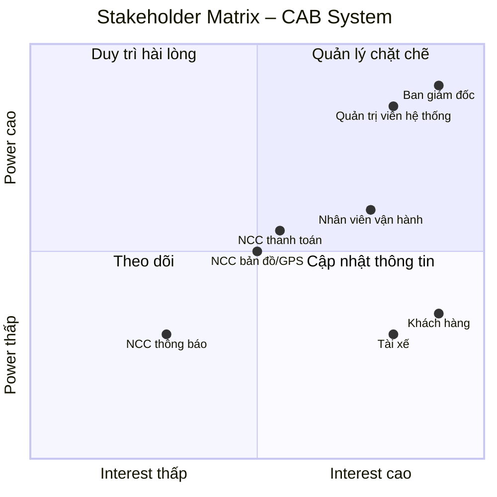
```mermaid
quadrantChart
    title Stakeholder Matrix – CAB System
    x-axis "Interest thấp" --> "Interest cao"
    y-axis "Power thấp" --> "Power cao"

    quadrant-1 "Quản lý chặt chẽ"
    quadrant-2 "Duy trì hài lòng"
    quadrant-3 "Theo dõi"
    quadrant-4 "Cập nhật thông tin"

    "Ban giám đốc": [0.9, 0.9]
    "Quản trị viên hệ thống": [0.8, 0.85]
    "Nhân viên vận hành": [0.75, 0.6]
    "Khách hàng": [0.9, 0.35]
    "Tài xế": [0.8, 0.3]
    "NCC thanh toán": [0.55, 0.55]
    "NCC bản đồ/GPS": [0.5, 0.5]
    "NCC thông báo": [0.3, 0.3]
```

---

# B3. CHUYỂN ĐỔI YÊU CẦU THÀNH MỤC TIÊU NGHIỆP VỤ (BUSINESS OBJECTIVE)

## B3.1. Mục đích

Từ yêu cầu khách hàng, BA xác định doanh nghiệp **muốn đạt được điều gì**, thay vì đi ngay vào chức năng hệ thống.

> **Lưu ý mã hoá:** mục tiêu nghiệp vụ dùng tiền tố **`BO-`** (Business Objective), tách biệt với **`BR-`** (Business Requirement) dùng ở B5, để tránh trùng mã khi hai tầng khái niệm có số lượng và ý nghĩa khác nhau.

## B3.2. Các bước thực hiện

```
Yêu cầu khách hàng
        ↓
Phân tích vấn đề hiện tại
        ↓
Xác định nhu cầu doanh nghiệp
        ↓
Xác định mục tiêu nghiệp vụ
        ↓
Mã hóa BO
```

## B3.3. Business Objectives (phạm vi MVP)

| Mã | Mục tiêu nghiệp vụ |
| --- | --- |
| **BO-01** | Doanh nghiệp cần quản lý tài khoản khách hàng. |
| **BO-02** | Doanh nghiệp cần khách hàng có thể tạo yêu cầu đặt xe. |
| **BO-03** | Doanh nghiệp cần quản lý thông tin tài xế. |
| **BO-04** | Doanh nghiệp cần biết tài xế nào đang có khả năng nhận chuyến. |
| **BO-05** | Doanh nghiệp cần phân công tài xế cho yêu cầu đặt xe. |
| **BO-06** | Doanh nghiệp cần chuyến xe được thực hiện trên hệ thống. |
| **BO-07** | Doanh nghiệp cần khách hàng biết tình trạng chuyến xe. |
| **BO-08** | Doanh nghiệp cần xử lý trường hợp tài xế không nhận chuyến. |
| **BO-09** | Doanh nghiệp cần lưu lại thông tin chuyến xe. |

## B3.4. Business Objectives ngoài phạm vi MVP (ghi nhận cho giai đoạn sau)

Ba mục tiêu dưới đây **có trong yêu cầu khách hàng gốc** nhưng chưa được đưa vào 2 module MVP (lý do tại B4.5). Ghi nhận ở đây để không bị thất lạc khỏi hồ sơ dự án.

| Mã | Mục tiêu nghiệp vụ | Nguồn gốc yêu cầu |
| --- | --- | --- |
| **BO-10** | Doanh nghiệp cần tính cước và thu tiền chuyến đi (tiền mặt + điện tử qua bên thứ ba). | Mục 0.4 |
| **BO-11** | Doanh nghiệp cần khách hàng đánh giá tài xế sau chuyến. | Mục 0.1, điểm 14 |
| **BO-12** | Ban lãnh đạo cần báo cáo số chuyến, doanh thu, tỷ lệ hoàn thành/hủy và hiệu quả tài xế. | Mục 0.6 |

---

# B4. XÁC ĐỊNH PHẠM VI MVP

## B4.1. Mục tiêu

Do thời gian dự án chỉ có **7 tuần**, không thể triển khai toàn bộ yêu cầu ngay trong giai đoạn đầu.

BA cần xác định những chức năng **quan trọng nhất để hệ thống có thể hoạt động**.

## B4.2. Các bước thực hiện

**Bước 1:** Liệt kê toàn bộ yêu cầu.
**Bước 2:** Đối chiếu với Business Objective.
**Bước 3:** Xác định chức năng bắt buộc để tạo luồng đặt xe.
**Bước 4:** Loại bỏ các chức năng nâng cao chưa cần thiết.
**Bước 5:** Xác định phạm vi MVP.

## B4.3. Hai module MVP

### Module 1 – Quản lý khách hàng

Bao gồm:

- Đăng ký.
- Đăng nhập.
- Quản lý thông tin cá nhân.
- Nhập điểm đón.
- Nhập điểm đến.
- Lựa chọn loại xe.
- Gửi yêu cầu đặt xe.
- Theo dõi chuyến.
- Xem thông tin tài xế.
- Xem lịch sử chuyến.

### Module 2 – Quản lý tài xế

Bao gồm:

- Đăng nhập.
- Quản lý thông tin tài xế.
- Quản lý phương tiện.
- Bật/tắt trạng thái sẵn sàng.
- Nhận chuyến.
- Từ chối chuyến.
- Cập nhật trạng thái chuyến.

## B4.4. Nguyên tắc quan trọng của MVP

> **Giai đoạn MVP không cần tìm tài xế tốt nhất.**

Chỉ cần:

```
Khách hàng đặt xe
      ↓
Hệ thống tìm tài xế phù hợp
      ↓
Tài xế đang sẵn sàng
      ↓
Gửi yêu cầu
      ↓
Tài xế nhận
      ↓
Thực hiện chuyến
```

MVP chỉ cần tìm **một tài xế phù hợp và đang sẵn sàng**, không cần thuật toán chọn tài xế tối ưu.

## B4.5. Ngoài phạm vi MVP

| Chức năng | MVP | Lý do hoãn / ghi chú |
| --- | --- | --- |
| Tìm tài xế tốt nhất | ❌ | Chỉ cần 1 tài xế phù hợp và sẵn sàng (B4.4) |
| Xếp hạng tài xế | ❌ | Chưa cần cho luồng đặt xe cơ bản |
| Tối ưu khoảng cách | ❌ | Ngoài phạm vi 7 tuần |
| Dispatch nâng cao | ❌ | Ngoài phạm vi 7 tuần |
| Giá động | ❌ | Cần chốt công thức tính cước (BR-Q05) trước |
| Voucher | ❌ | Chưa có trong yêu cầu MVP |
| Ví điện tử | ❌ | Chưa có trong yêu cầu MVP |
| Chat | ❌ | Chưa có trong yêu cầu MVP |
| Đặt xe trước | ❌ | Chưa có trong yêu cầu MVP |
| Nhiều điểm đón/trả | ❌ | Chưa có trong yêu cầu MVP |
| **Thanh toán (tiền mặt/điện tử) & tính cước** | ❌ | Có trong yêu cầu gốc (mục 0.4, BO-10) nhưng cần chốt công thức cước, phụ phí và nhà cung cấp thanh toán trước khi thiết kế (BR-Q05, BR-Q06) |
| **Đánh giá tài xế sau chuyến** | ❌ | Có trong yêu cầu gốc (mục 0.1, BO-11); phụ thuộc chuyến đã hoàn thành ổn định trước |
| **Báo cáo vận hành (doanh thu, tỷ lệ hoàn thành/hủy, hiệu quả tài xế)** | ❌ | Có trong yêu cầu gốc (mục 0.6, BO-12); cần đủ dữ liệu chuyến thực tế và chốt chỉ số báo cáo (BR-Q12) |
| **Ước tính thời gian tài xế đến (ETA)** | ❌ | Có trong yêu cầu gốc (mục 0.1); cần tích hợp nhà cung cấp bản đồ/GPS tính khoảng cách-thời gian di chuyển |

---

# B5. BUSINESS REQUIREMENT

## B5.1. Mục đích

Chuyển các Business Objective (BO) thành yêu cầu cụ thể mà **hệ thống phải cung cấp**, đánh mã **`BR-`**.

## B5.2. Các bước thực hiện

```
Business Objective (BO)
        ↓
Phân tích nhu cầu
        ↓
Xác định hệ thống phải làm gì
        ↓
Viết Business Requirement
        ↓
Đánh mã BR
```

## B5.3. Business Requirement – Quản lý khách hàng (thực hiện BO-01, BO-02, BO-07, BO-09)

| Business | Mã | Business Requirement |
| --- | --- | --- |
| B1. Quản lý tài khoản khách hàng | **BR-01** | Hệ thống phải cho phép khách hàng đăng ký tài khoản. |
| | **BR-02** | Hệ thống phải cho phép khách hàng đăng nhập. |
| | **BR-03** | Hệ thống phải cho phép khách hàng xem và cập nhật thông tin cá nhân. |
| B2. Tạo yêu cầu đặt xe | **BR-04** | Hệ thống phải cho phép khách hàng nhập điểm đón. |
| | **BR-05** | Hệ thống phải cho phép khách hàng nhập điểm đến. |
| | **BR-06** | Hệ thống phải cho phép khách hàng lựa chọn loại xe. |
| | **BR-07** | Hệ thống phải cho phép khách hàng gửi yêu cầu đặt xe. |
| B3. Theo dõi chuyến | **BR-08** | Hệ thống phải cho phép khách hàng theo dõi trạng thái yêu cầu đặt xe. |
| | **BR-09** | Hệ thống phải hiển thị tài xế được phân công. |
| | **BR-10** | Hệ thống phải cho phép khách hàng theo dõi trạng thái chuyến. |
| | **BR-11** | Hệ thống phải cho phép khách hàng xem lịch sử chuyến đã hoàn thành. |

## B5.4. Business Requirement – Quản lý tài xế (thực hiện BO-03, BO-04, BO-06)

| Business | Mã | Business Requirement |
| --- | --- | --- |
| B4. Quản lý tài xế | **BR-12** | Hệ thống phải cho phép tài xế đăng nhập. |
| | **BR-13** | Hệ thống phải cho phép tài xế xem và cập nhật thông tin cá nhân. |
| | **BR-14** | Hệ thống phải cho phép quản lý thông tin phương tiện. |
| | **BR-15** | Hệ thống phải cho phép tài xế cập nhật trạng thái sẵn sàng. |
| B5. Tiếp nhận chuyến | **BR-16** | Hệ thống phải gửi yêu cầu chuyến đến tài xế phù hợp. |
| | **BR-17** | Hệ thống phải cho phép tài xế chấp nhận hoặc từ chối chuyến. |
| | **BR-18** | Hệ thống phải ghi nhận tài xế được phân công khi tài xế nhận chuyến. |
| B6. Thực hiện chuyến | **BR-19** | Hệ thống phải cho phép tài xế cập nhật trạng thái chuyến. |
| | **BR-20** | Hệ thống phải ghi nhận vị trí tài xế trong quá trình phục vụ chuyến. |

## B5.5. Business Requirement – Tìm và phân công tài xế (thực hiện BO-05, BO-08)

| Business | Mã | Business Requirement |
| --- | --- | --- |
| B7. Tìm tài xế | **BR-21** | Hệ thống phải tìm các tài xế đang sẵn sàng nhận chuyến. |
| | **BR-22** | Hệ thống phải tìm tài xế có loại xe phù hợp với loại xe khách hàng chọn. |
| | **BR-23** | Hệ thống phải phân công tài xế khi tài xế chấp nhận. |
| B8. Xử lý từ chối | **BR-24** | Nếu tài xế từ chối hoặc không phản hồi, hệ thống phải tiếp tục tìm tài xế khác. |
| | **BR-25** | Nếu không tìm được tài xế, hệ thống phải thông báo cho khách hàng. |
| B9. Quản lý trạng thái | **BR-26** | Hệ thống phải quản lý trạng thái chuyến từ khi tìm tài xế đến khi hoàn thành. |

`BR-01` đến `BR-26` hiện thực đầy đủ `BO-01` đến `BO-09`. `BO-10, BO-11, BO-12` (thanh toán, đánh giá, báo cáo) **chưa có BR tương ứng** trong đợt MVP này — xem B13.4 để theo dõi khi triển khai giai đoạn sau.

---

# B6. MÔ HÌNH HÓA NGHIỆP VỤ

## B6.1. Mục đích

Business Process Modeling mô tả **cách nghiệp vụ thực sự diễn ra**.

Không chỉ nói:
> Hệ thống phải làm gì?

mà phải mô tả:
> Ai thực hiện → thực hiện gì → hệ thống xử lý gì → kết quả gì → trường hợp ngoại lệ xử lý thế nào?

## B6.2. Các bước thực hiện

```
Business Requirement
        ↓
Xác định Actor
        ↓
Xác định Input
        ↓
Xác định hoạt động
        ↓
Xác định hệ thống xử lý
        ↓
Xác định Decision
        ↓
Xác định Exception
        ↓
Xác định Output
        ↓
Business Process
```

## B6.3. Danh sách quy trình

| Mã | Quy trình | BR liên quan |
| --- | --- | --- |
| BP-01 | Đăng ký tài khoản khách hàng | BR-01 |
| BP-02 | Đăng nhập khách hàng | BR-02 |
| BP-03 | Cập nhật thông tin khách hàng | BR-03 |
| BP-04 | Tạo yêu cầu đặt xe | BR-04 → BR-07 |
| BP-05 | Đăng nhập và quản lý tài xế | BR-12 → BR-15 |
| BP-06 | Tìm tài xế phù hợp | BR-21, BR-22 |
| BP-07 | Tiếp nhận và phân công chuyến | BR-16 → BR-18, BR-23 → BR-25 |
| BP-08 | Thực hiện chuyến | BR-19, BR-26 |
| BP-09 | Theo dõi chuyến | BR-08 → BR-10 |
| BP-10 | Lưu lịch sử chuyến | BR-11 |

## B6.4. Quy trình tổng thể

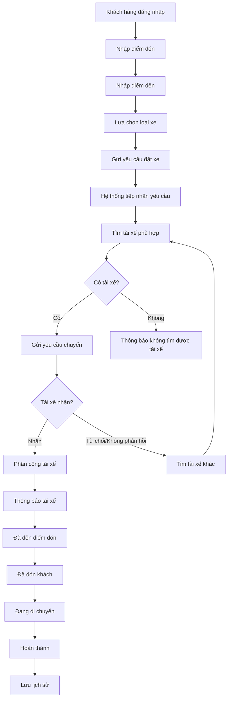
```mermaid
flowchart TD
    A[Khách hàng đăng nhập]
    B[Nhập điểm đón]
    C[Nhập điểm đến]
    D[Lựa chọn loại xe]
    E[Gửi yêu cầu đặt xe]
    F[Hệ thống tiếp nhận yêu cầu]
    G[Tìm tài xế phù hợp]
    H{Có tài xế?}
    I[Gửi yêu cầu chuyến]
    J{Tài xế nhận?}
    K[Tìm tài xế khác]
    L[Phân công tài xế]
    M[Thông báo tài xế]
    N[Đã đến điểm đón]
    O[Đã đón khách]
    P[Đang di chuyển]
    Q[Hoàn thành]
    R[Lưu lịch sử]
    S[Thông báo không tìm được tài xế]

    A --> B
    B --> C
    C --> D
    D --> E
    E --> F
    F --> G
    G --> H

    H -- Có --> I
    H -- Không --> S

    I --> J
    J -- Nhận --> L
    J -- Từ chối/Không phản hồi --> K
    K --> G

    L --> M
    M --> N
    N --> O
    O --> P
    P --> Q
    Q --> R
```

### Sequence Diagram 01 – BP-01: Đăng ký tài khoản khách hàng

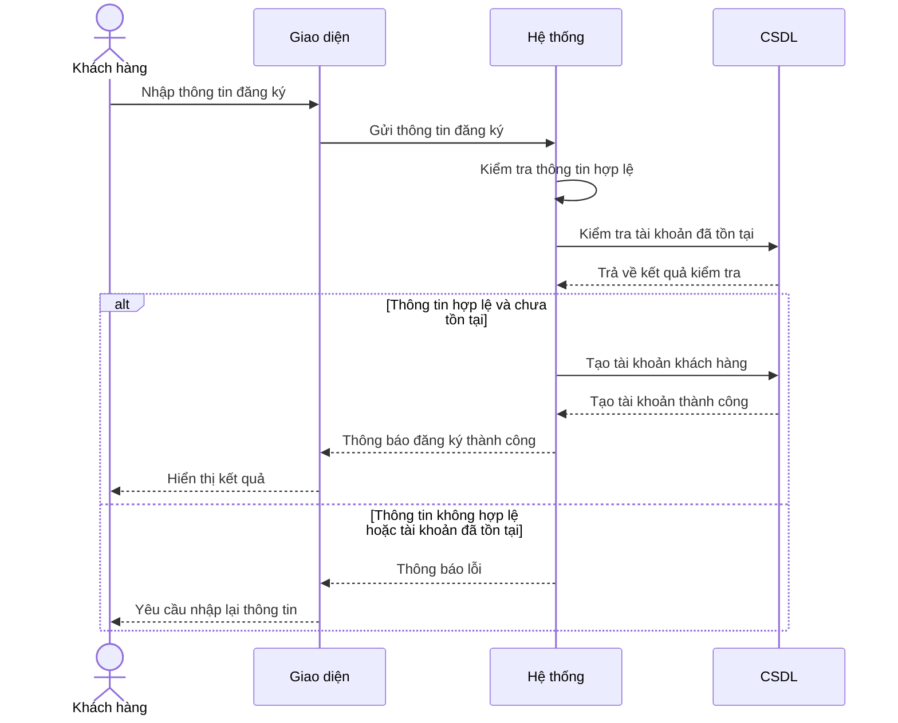
```mermaid
sequenceDiagram
    actor KH as Khách hàng
    participant UI as Giao diện
    participant SYS as Hệ thống
    participant DB as CSDL

    KH->>UI: Nhập thông tin đăng ký
    UI->>SYS: Gửi thông tin đăng ký
    SYS->>SYS: Kiểm tra thông tin hợp lệ
    SYS->>DB: Kiểm tra tài khoản đã tồn tại
    DB-->>SYS: Trả về kết quả kiểm tra

    alt Thông tin hợp lệ và chưa tồn tại
        SYS->>DB: Tạo tài khoản khách hàng
        DB-->>SYS: Tạo tài khoản thành công
        SYS-->>UI: Thông báo đăng ký thành công
        UI-->>KH: Hiển thị kết quả
    else Thông tin không hợp lệ hoặc tài khoản đã tồn tại
        SYS-->>UI: Thông báo lỗi
        UI-->>KH: Yêu cầu nhập lại thông tin
    end
```

### Sequence Diagram 02 – BP-02: Đăng nhập khách hàng

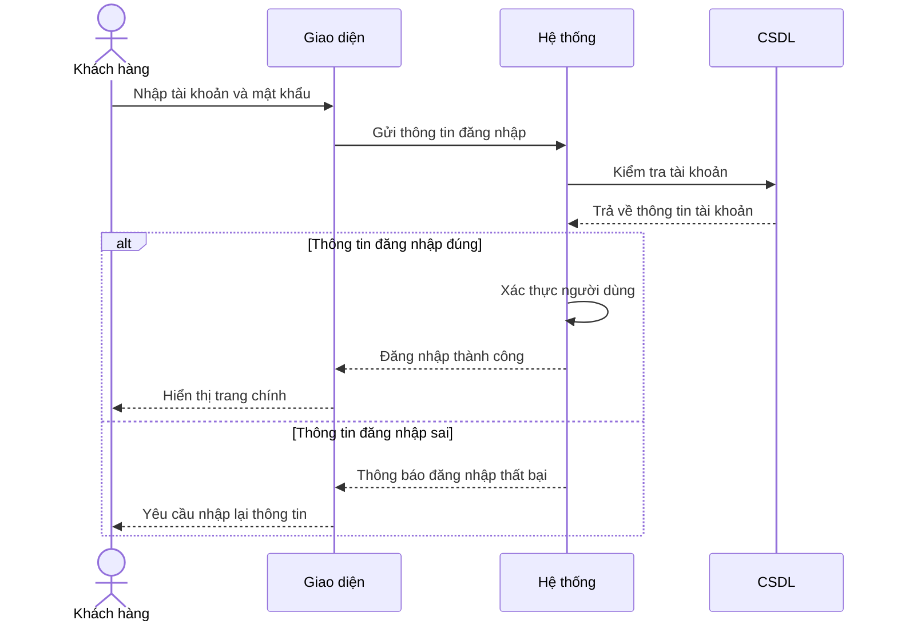
```mermaid
sequenceDiagram
    actor KH as Khách hàng
    participant UI as Giao diện
    participant SYS as Hệ thống
    participant DB as CSDL

    KH->>UI: Nhập tài khoản và mật khẩu
    UI->>SYS: Gửi thông tin đăng nhập
    SYS->>DB: Kiểm tra tài khoản
    DB-->>SYS: Trả về thông tin tài khoản

    alt Thông tin đăng nhập đúng
        SYS->>SYS: Xác thực người dùng
        SYS-->>UI: Đăng nhập thành công
        UI-->>KH: Hiển thị trang chính
    else Thông tin đăng nhập sai
        SYS-->>UI: Thông báo đăng nhập thất bại
        UI-->>KH: Yêu cầu nhập lại thông tin
    end
```

### Sequence Diagram 03 – BP-03: Cập nhật thông tin khách hàng

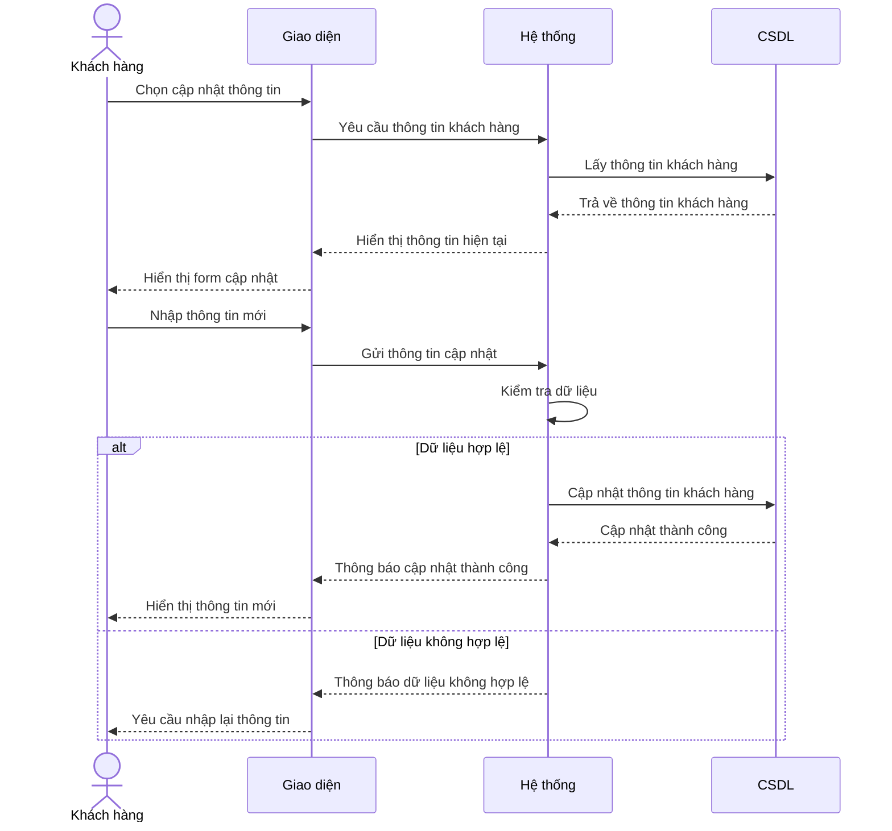
```mermaid
sequenceDiagram
    actor KH as Khách hàng
    participant UI as Giao diện
    participant SYS as Hệ thống
    participant DB as CSDL

    KH->>UI: Chọn cập nhật thông tin
    UI->>SYS: Yêu cầu thông tin khách hàng
    SYS->>DB: Lấy thông tin khách hàng
    DB-->>SYS: Trả về thông tin khách hàng
    SYS-->>UI: Hiển thị thông tin hiện tại
    UI-->>KH: Hiển thị form cập nhật

    KH->>UI: Nhập thông tin mới
    UI->>SYS: Gửi thông tin cập nhật
    SYS->>SYS: Kiểm tra dữ liệu

    alt Dữ liệu hợp lệ
        SYS->>DB: Cập nhật thông tin khách hàng
        DB-->>SYS: Cập nhật thành công
        SYS-->>UI: Thông báo cập nhật thành công
        UI-->>KH: Hiển thị thông tin mới
    else Dữ liệu không hợp lệ
        SYS-->>UI: Thông báo dữ liệu không hợp lệ
        UI-->>KH: Yêu cầu nhập lại thông tin
    end
```

### Sequence Diagram 04 – BP-04: Tạo yêu cầu đặt xe

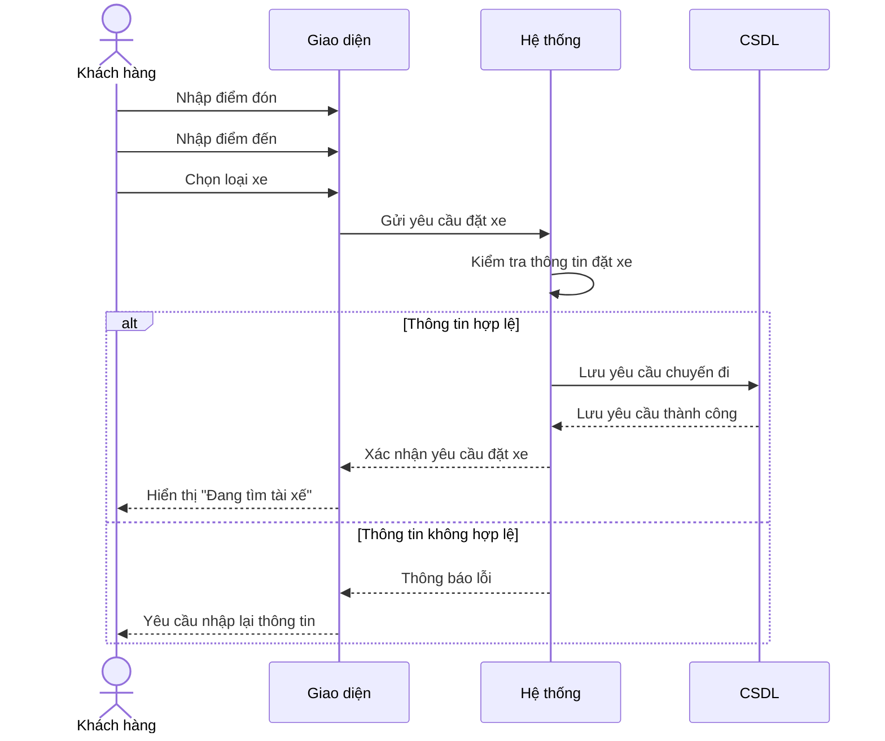
```mermaid
sequenceDiagram
    actor KH as Khách hàng
    participant UI as Giao diện
    participant SYS as Hệ thống
    participant DB as CSDL

    KH->>UI: Nhập điểm đón
    KH->>UI: Nhập điểm đến
    KH->>UI: Chọn loại xe
    UI->>SYS: Gửi yêu cầu đặt xe
    SYS->>SYS: Kiểm tra thông tin đặt xe

    alt Thông tin hợp lệ
        SYS->>DB: Lưu yêu cầu chuyến đi
        DB-->>SYS: Lưu yêu cầu thành công
        SYS-->>UI: Xác nhận yêu cầu đặt xe
        UI-->>KH: Hiển thị "Đang tìm tài xế"
    else Thông tin không hợp lệ
        SYS-->>UI: Thông báo lỗi
        UI-->>KH: Yêu cầu nhập lại thông tin
    end
```

### Sequence Diagram 05 – BP-05: Đăng nhập và quản lý tài xế

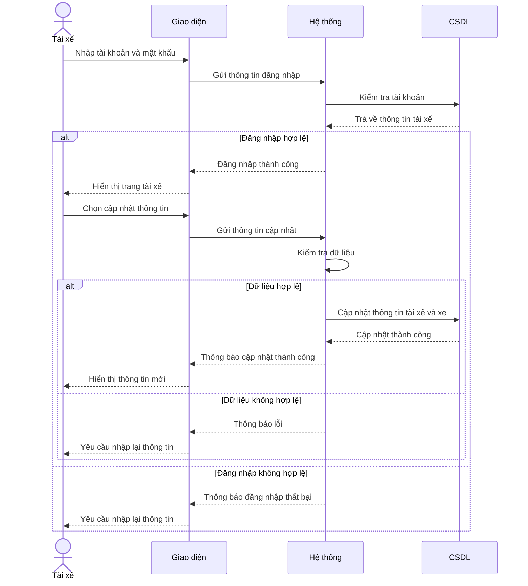
```mermaid
sequenceDiagram
    actor TX as Tài xế
    participant UI as Giao diện
    participant SYS as Hệ thống
    participant DB as CSDL

    TX->>UI: Nhập tài khoản và mật khẩu
    UI->>SYS: Gửi thông tin đăng nhập
    SYS->>DB: Kiểm tra tài khoản
    DB-->>SYS: Trả về thông tin tài xế

    alt Đăng nhập hợp lệ
        SYS-->>UI: Đăng nhập thành công
        UI-->>TX: Hiển thị trang tài xế

        TX->>UI: Chọn cập nhật thông tin
        UI->>SYS: Gửi thông tin cập nhật
        SYS->>SYS: Kiểm tra dữ liệu

        alt Dữ liệu hợp lệ
            SYS->>DB: Cập nhật thông tin tài xế và xe
            DB-->>SYS: Cập nhật thành công
            SYS-->>UI: Thông báo cập nhật thành công
            UI-->>TX: Hiển thị thông tin mới
        else Dữ liệu không hợp lệ
            SYS-->>UI: Thông báo lỗi
            UI-->>TX: Yêu cầu nhập lại thông tin
        end

    else Đăng nhập không hợp lệ
        SYS-->>UI: Thông báo đăng nhập thất bại
        UI-->>TX: Yêu cầu nhập lại thông tin
    end
```

### Sequence Diagram 06 – BP-06: Tìm tài xế phù hợp

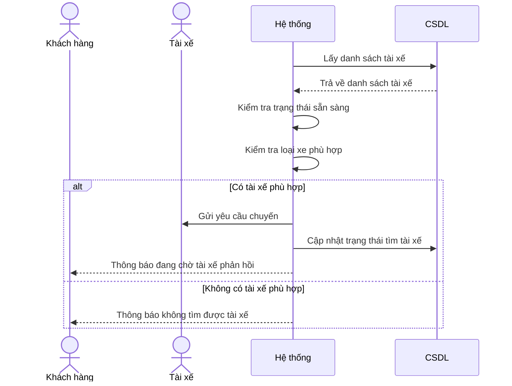
```mermaid
sequenceDiagram
    actor KH as Khách hàng
    actor TX as Tài xế
    participant SYS as Hệ thống
    participant DB as CSDL

    SYS->>DB: Lấy danh sách tài xế
    DB-->>SYS: Trả về danh sách tài xế

    SYS->>SYS: Kiểm tra trạng thái sẵn sàng
    SYS->>SYS: Kiểm tra loại xe phù hợp

    alt Có tài xế phù hợp
        SYS->>TX: Gửi yêu cầu chuyến
        SYS->>DB: Cập nhật trạng thái tìm tài xế
        SYS-->>KH: Thông báo đang chờ tài xế phản hồi
    else Không có tài xế phù hợp
        SYS-->>KH: Thông báo không tìm được tài xế
    end
```

### Sequence Diagram 07 – BP-07: Tiếp nhận và phân công chuyến

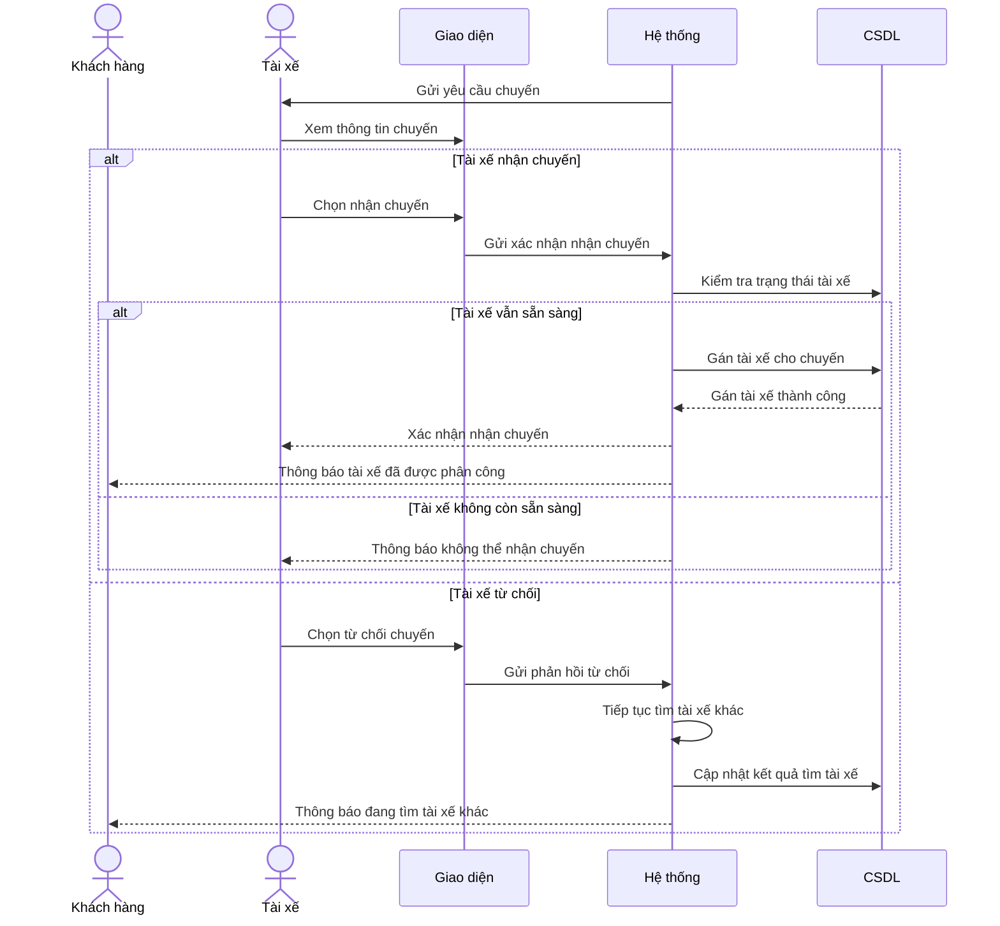
```mermaid
sequenceDiagram
    actor KH as Khách hàng
    actor TX as Tài xế
    participant UI as Giao diện
    participant SYS as Hệ thống
    participant DB as CSDL

    SYS->>TX: Gửi yêu cầu chuyến
    TX->>UI: Xem thông tin chuyến

    alt Tài xế nhận chuyến
        TX->>UI: Chọn nhận chuyến
        UI->>SYS: Gửi xác nhận nhận chuyến
        SYS->>DB: Kiểm tra trạng thái tài xế

        alt Tài xế vẫn sẵn sàng
            SYS->>DB: Gán tài xế cho chuyến
            DB-->>SYS: Gán tài xế thành công
            SYS-->>TX: Xác nhận nhận chuyến
            SYS-->>KH: Thông báo tài xế đã được phân công
        else Tài xế không còn sẵn sàng
            SYS-->>TX: Thông báo không thể nhận chuyến
        end

    else Tài xế từ chối
        TX->>UI: Chọn từ chối chuyến
        UI->>SYS: Gửi phản hồi từ chối
        SYS->>SYS: Tiếp tục tìm tài xế khác
        SYS->>DB: Cập nhật kết quả tìm tài xế
        SYS-->>KH: Thông báo đang tìm tài xế khác
    end
```

### Sequence Diagram 08 – BP-08: Thực hiện chuyến

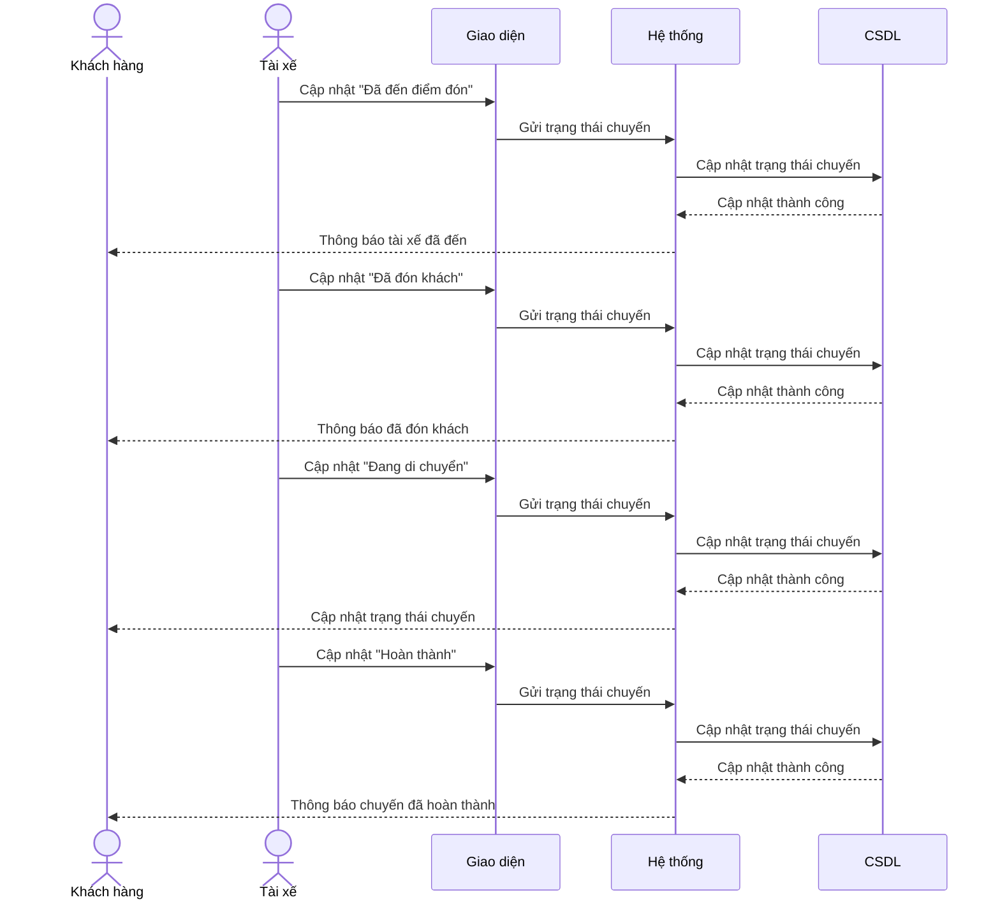
```mermaid
sequenceDiagram
    actor KH as Khách hàng
    actor TX as Tài xế
    participant UI as Giao diện
    participant SYS as Hệ thống
    participant DB as CSDL

    TX->>UI: Cập nhật "Đã đến điểm đón"
    UI->>SYS: Gửi trạng thái chuyến
    SYS->>DB: Cập nhật trạng thái chuyến
    DB-->>SYS: Cập nhật thành công
    SYS-->>KH: Thông báo tài xế đã đến

    TX->>UI: Cập nhật "Đã đón khách"
    UI->>SYS: Gửi trạng thái chuyến
    SYS->>DB: Cập nhật trạng thái chuyến
    DB-->>SYS: Cập nhật thành công
    SYS-->>KH: Thông báo đã đón khách

    TX->>UI: Cập nhật "Đang di chuyển"
    UI->>SYS: Gửi trạng thái chuyến
    SYS->>DB: Cập nhật trạng thái chuyến
    DB-->>SYS: Cập nhật thành công
    SYS-->>KH: Cập nhật trạng thái chuyến

    TX->>UI: Cập nhật "Hoàn thành"
    UI->>SYS: Gửi trạng thái chuyến
    SYS->>DB: Cập nhật trạng thái chuyến
    DB-->>SYS: Cập nhật thành công
    SYS-->>KH: Thông báo chuyến đã hoàn thành
```

### Sequence Diagram 09 – BP-09: Theo dõi chuyến

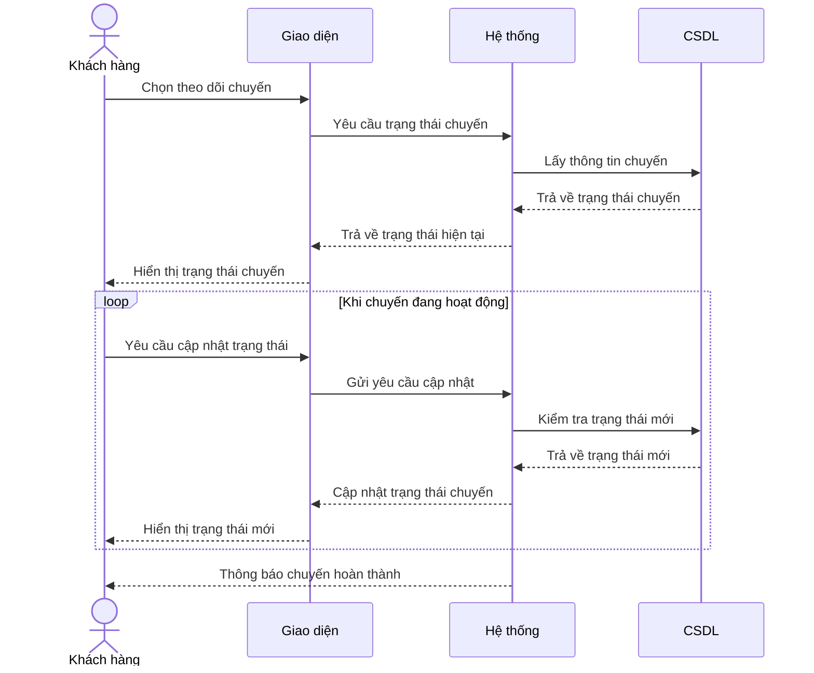
```mermaid
sequenceDiagram
    actor KH as Khách hàng
    participant UI as Giao diện
    participant SYS as Hệ thống
    participant DB as CSDL

    KH->>UI: Chọn theo dõi chuyến
    UI->>SYS: Yêu cầu trạng thái chuyến
    SYS->>DB: Lấy thông tin chuyến
    DB-->>SYS: Trả về trạng thái chuyến
    SYS-->>UI: Trả về trạng thái hiện tại
    UI-->>KH: Hiển thị trạng thái chuyến

    loop Khi chuyến đang hoạt động
        KH->>UI: Yêu cầu cập nhật trạng thái
        UI->>SYS: Gửi yêu cầu cập nhật
        SYS->>DB: Kiểm tra trạng thái mới
        DB-->>SYS: Trả về trạng thái mới
        SYS-->>UI: Cập nhật trạng thái chuyến
        UI-->>KH: Hiển thị trạng thái mới
    end

    SYS-->>KH: Thông báo chuyến hoàn thành
```

### Sequence Diagram 10 – BP-10: Lưu lịch sử chuyến

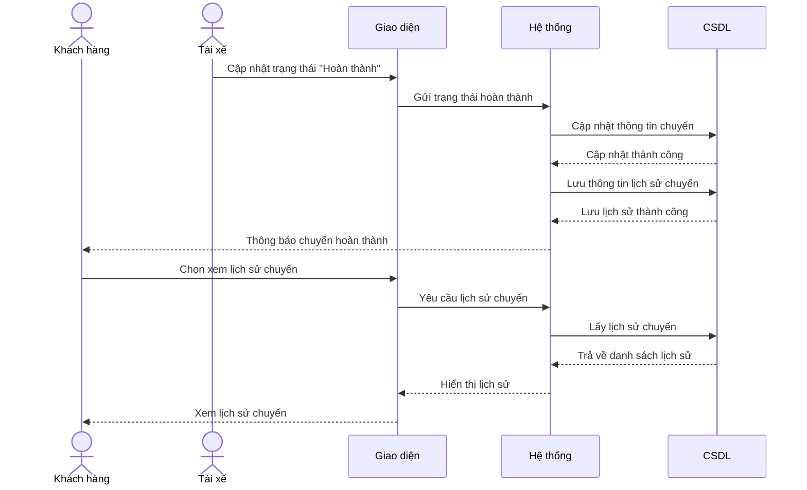
```mermaid
sequenceDiagram
    actor KH as Khách hàng
    actor TX as Tài xế
    participant UI as Giao diện
    participant SYS as Hệ thống
    participant DB as CSDL

    TX->>UI: Cập nhật trạng thái "Hoàn thành"
    UI->>SYS: Gửi trạng thái hoàn thành
    SYS->>DB: Cập nhật thông tin chuyến
    DB-->>SYS: Cập nhật thành công

    SYS->>DB: Lưu thông tin lịch sử chuyến
    DB-->>SYS: Lưu lịch sử thành công

    SYS-->>KH: Thông báo chuyến hoàn thành

    KH->>UI: Chọn xem lịch sử chuyến
    UI->>SYS: Yêu cầu lịch sử chuyến
    SYS->>DB: Lấy lịch sử chuyến
    DB-->>SYS: Trả về danh sách lịch sử
    SYS-->>UI: Hiển thị lịch sử
    UI-->>KH: Xem lịch sử chuyến
```

---

# B7. FUNCTIONAL REQUIREMENT

## B7.1. Mục đích

FR mô tả **chức năng cụ thể của hệ thống** để thực hiện Business Requirement.

## B7.2. Công thức

```
BR
 ↓
Hệ thống phải làm gì?
 ↓
FR
 ↓
Input → Processing → Output
```

## B7.3. Functional Requirement

| Mã FR | BR | Functional Requirement |
| --- | --- | --- |
| FR-01 | BR-01 | Cho phép khách hàng nhập thông tin và đăng ký tài khoản. |
| FR-02 | BR-02 | Cho phép khách hàng nhập thông tin và đăng nhập. |
| FR-03 | BR-03 | Cho phép khách hàng xem, chỉnh sửa và lưu thông tin cá nhân. |
| FR-04 | BR-04 | Cho phép nhập điểm đón. |
| FR-05 | BR-05 | Cho phép nhập điểm đến. |
| FR-06 | BR-06 | Hiển thị danh sách loại xe và cho phép lựa chọn. |
| FR-07 | BR-07 | Kiểm tra và tạo yêu cầu đặt xe. |
| FR-08 | BR-08 | Hiển thị trạng thái xử lý yêu cầu đặt xe. |
| FR-09 | BR-09 | Hiển thị thông tin tài xế được phân công. |
| FR-10 | BR-10 | Hiển thị trạng thái hiện tại của chuyến. |
| FR-11 | BR-11 | Hiển thị lịch sử chuyến đã hoàn thành. |
| FR-12 | BR-12 | Xác thực tài khoản tài xế và cho phép đăng nhập. |
| FR-13 | BR-13 | Cho phép tài xế xem và cập nhật hồ sơ. |
| FR-14 | BR-14 | Cho phép quản lý xem và cập nhật phương tiện. |
| FR-15 | BR-15 | Cho phép tài xế chuyển trạng thái sẵn sàng/không sẵn sàng. |
| FR-16 | BR-16 | Tìm và gửi yêu cầu chuyến đến tài xế phù hợp. |
| FR-17 | BR-17 | Cho phép tài xế chấp nhận hoặc từ chối chuyến. |
| FR-18 | BR-18 | Ghi nhận tài xế được phân công. |
| FR-19 | BR-19 | Cho phép tài xế cập nhật trạng thái chuyến. |
| FR-20 | BR-20 | Ghi nhận thông tin vị trí tài xế. |
| FR-21 | BR-21 | Tìm tài xế đang sẵn sàng. |
| FR-22 | BR-22 | Kiểm tra loại xe phù hợp. |
| FR-23 | BR-23 | Gán tài xế cho chuyến khi tài xế chấp nhận. |
| FR-24 | BR-24 | Tiếp tục tìm tài xế khác khi bị từ chối/không phản hồi. |
| FR-25 | BR-25 | Thông báo không tìm được tài xế. |
| FR-26 | BR-26 | Quản lý trạng thái chuyến từ tìm tài xế đến hoàn thành. |

---

# B8. BUSINESS RULES

## B8.1. Mục đích

Business Rule quy định **luật nghiệp vụ mà hệ thống bắt buộc phải tuân thủ**.

FR trả lời:
> Hệ thống làm gì?

Business Rule trả lời:
> Hệ thống phải làm theo quy tắc nào?

## B8.2. Các bước xác định Business Rule

**Bước 1:** Đọc BR.
**Bước 2:** Tìm điều kiện/ràng buộc.
**Bước 3:** Tìm trường hợp ngoại lệ.
**Bước 4:** Xác định điều gì được phép/không được phép.
**Bước 5:** Chuẩn hóa thành Business Rule.

## B8.3. Business Rules

| Mã | Business Rule |
| --- | --- |
| BRL-01 | Khách hàng phải đăng nhập trước khi đặt xe. |
| BRL-02 | Tài xế phải đăng nhập trước khi nhận chuyến. |
| BRL-03 | Yêu cầu đặt xe phải có điểm đón, điểm đến và loại xe. |
| BRL-04 | Chỉ tài xế đang sẵn sàng mới được xem xét nhận chuyến. |
| BRL-05 | Tài xế phải có loại xe phù hợp với yêu cầu của khách hàng. |
| BRL-06 | Một chuyến chỉ được phân công cho một tài xế tại một thời điểm. |
| BRL-07 | Tài xế đang thực hiện chuyến không được nhận chuyến khác. |
| BRL-08 | Nếu tài xế từ chối hoặc không phản hồi, hệ thống phải tìm tài xế khác. |
| BRL-09 | Nếu không còn tài xế phù hợp, hệ thống phải thông báo cho khách hàng. |
| BRL-10 | Chỉ tài xế được phân công mới được cập nhật trạng thái chuyến. |
| BRL-11 | Trạng thái chuyến phải được cập nhật theo đúng trình tự nghiệp vụ. |
| BRL-12 | Khi chuyến hoàn thành, hệ thống phải lưu trạng thái hoàn thành. |
| BRL-13 | Thông tin cá nhân khách hàng và tài xế phải được bảo vệ. |
| BRL-14 | Các thao tác quản trị phải được kiểm soát theo quyền. |
| BRL-15 | Các thao tác quan trọng phải được lưu vết. |
| **BRL-16** | **Nhân viên vận hành chỉ được xem và hỗ trợ xử lý nghiệp vụ hằng ngày (khách hàng, tài xế, phương tiện, chuyến); chỉ Quản trị viên hệ thống mới được khóa/mở khóa tài khoản, thay đổi cấu hình hệ thống và xem báo cáo doanh thu.** *(bổ sung)* |

## B8.4. Business Rules cần khách hàng xác nhận

| Mã | Nội dung cần xác nhận |
| --- | --- |
| BR-Q01 | Bán kính tối đa tìm tài xế là bao nhiêu? |
| BR-Q02 | Tài xế có bao nhiêu giây/phút để phản hồi? |
| BR-Q03 | Sau bao lâu hệ thống chuyển sang tài xế khác? |
| BR-Q04 | Có tiêu chí ưu tiên nào ngoài loại xe và trạng thái sẵn sàng không? |
| BR-Q05 | Công thức tính cước là gì? |
| BR-Q06 | Có phụ phí theo thời gian, khoảng cách hoặc loại xe không? |
| BR-Q07 | Khách hàng có được hủy chuyến không? |
| BR-Q08 | Có phí hủy chuyến không? |
| BR-Q09 | Nếu tài xế hủy, hệ thống có tự động tìm tài xế khác không? |
| BR-Q10 | Khi mất mạng/GPS, trạng thái chuyến được xử lý thế nào? |
| BR-Q11 | Dữ liệu được lưu trong bao lâu? |
| **BR-Q12** | **Báo cáo vận hành cần những chỉ số nào (số chuyến, doanh thu, tỷ lệ hoàn thành/hủy, hiệu quả tài xế) và xuất theo tần suất nào?** *(bổ sung)* |
| **BR-Q13** | **Ngoài Quản trị viên hệ thống, còn vai trò nào được phép xem báo cáo doanh thu?** *(bổ sung)* |

---

# B9. NGHIỆP VỤ PHI CHỨC NĂNG

## B9.1. Mục đích

NFR xác định **hệ thống phải hoạt động như thế nào**, không chỉ hệ thống có chức năng gì.

## B9.2. Các bước thực hiện

```
Yêu cầu khách hàng
        ↓
Xác định chất lượng cần đạt
        ↓
Hiệu năng
Bảo mật
Sẵn sàng
Mở rộng
Tin cậy
Bảo trì
        ↓
NFR
```

## B9.3. Danh sách NFR

| Mã | Nhóm | Yêu cầu |
| --- | --- | --- |
| NFR-01 | Hiệu năng | Hệ thống phải phản hồi thao tác thông thường trong thời gian phù hợp. |
| NFR-02 | Khả năng chịu tải | Hệ thống phải xử lý đồng thời nhiều yêu cầu đặt xe. |
| NFR-03 | Sẵn sàng | Hệ thống phải hoạt động ổn định trong thời gian cung cấp dịch vụ. |
| NFR-04 | Bảo mật | Người dùng phải được xác thực trước khi sử dụng chức năng yêu cầu tài khoản. |
| NFR-05 | Phân quyền | Chức năng quản trị phải được kiểm soát theo quyền (xem BRL-16: Operator ≠ Admin). |
| NFR-06 | Bảo vệ dữ liệu | Thông tin khách hàng và tài xế phải được bảo vệ khỏi truy cập trái phép. |
| NFR-07 | Tin cậy | Lỗi một thành phần (ví dụ thanh toán, thông báo) không được làm dừng toàn bộ hệ thống đặt xe. |
| NFR-08 | Khả năng mở rộng | Có thể thêm loại dịch vụ mới, phương thức thanh toán mới và kênh/nhà cung cấp thông báo mới mà không cần xây dựng lại toàn bộ hệ thống. |
| NFR-09 | Khả năng bảo trì | Các thành phần nên tương đối độc lập để dễ sửa lỗi, nâng cấp và triển khai từng phần. |
| NFR-10 | Audit | Các thao tác quan trọng phải có khả năng truy vết. |

---

# B10. ERD – XÁC ĐỊNH ENTITY VÀ MÔ HÌNH THỰC THỂ KẾT HỢP

## B10.1. Mục đích

Xác định dữ liệu mà hệ thống cần lưu trữ để phục vụ các BR/FR.

## B10.2. Các bước thực hiện

```
BR / FR
  ↓
Tìm danh từ quan trọng
  ↓
Xác định Entity
  ↓
Xác định Attribute
  ↓
Xác định Primary Key
  ↓
Xác định Foreign Key
  ↓
Xác định Relationship
  ↓
ERD
```

## B10.3. Entity (phạm vi MVP)

| STT | Entity | Mô tả |
| --- | --- | --- |
| 1 | Customer | Thông tin khách hàng |
| 2 | Driver | Thông tin tài xế |
| 3 | Vehicle | Thông tin phương tiện |
| 4 | VehicleType | Loại xe |
| 5 | Trip | Thông tin chuyến |
| 6 | TripStatus | Trạng thái chuyến |

## B10.4. Quan hệ

| Quan hệ | Cardinality |
| --- | --- |
| Customer – Trip | 1:N |
| Driver – Trip | 1:N |
| Driver – Vehicle | 1:N |
| VehicleType – Vehicle | 1:N |
| VehicleType – Trip | 1:N |
| TripStatus – Trip | 1:N |

## B10.5. Mermaid ERD

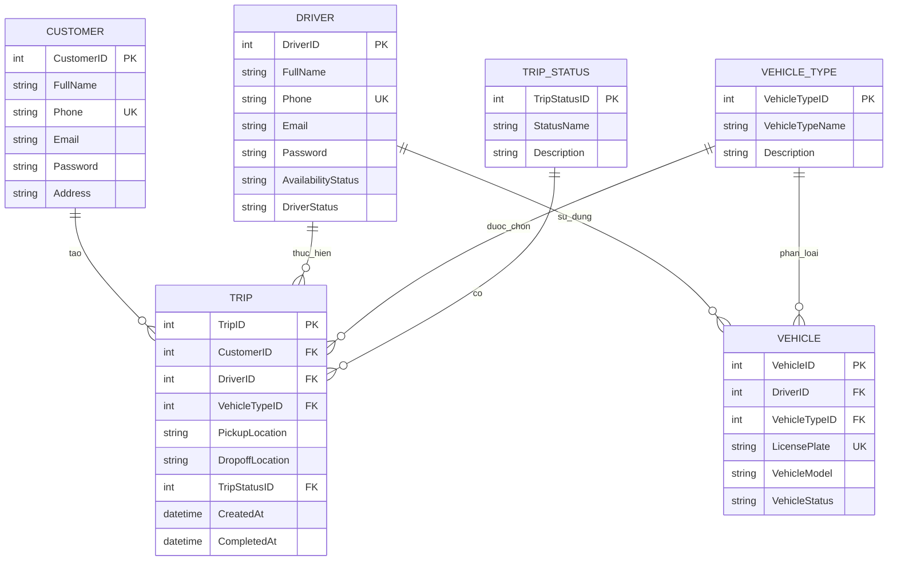
```mermaid
erDiagram

    CUSTOMER ||--o{ TRIP : tao
    DRIVER ||--o{ TRIP : thuc_hien
    DRIVER ||--o{ VEHICLE : su_dung
    VEHICLE_TYPE ||--o{ VEHICLE : phan_loai
    VEHICLE_TYPE ||--o{ TRIP : duoc_chon
    TRIP_STATUS ||--o{ TRIP : co

    CUSTOMER {
        int CustomerID PK
        string FullName
        string Phone UK
        string Email
        string Password
        string Address
    }

    DRIVER {
        int DriverID PK
        string FullName
        string Phone UK
        string Email
        string Password
        string AvailabilityStatus
        string DriverStatus
    }

    VEHICLE {
        int VehicleID PK
        int DriverID FK
        int VehicleTypeID FK
        string LicensePlate UK
        string VehicleModel
        string VehicleStatus
    }

    VEHICLE_TYPE {
        int VehicleTypeID PK
        string VehicleTypeName
        string Description
    }

    TRIP {
        int TripID PK
        int CustomerID FK
        int DriverID FK
        int VehicleTypeID FK
        string PickupLocation
        string DropoffLocation
        int TripStatusID FK
        datetime CreatedAt
        datetime CompletedAt
    }

    TRIP_STATUS {
        int TripStatusID PK
        string StatusName
        string Description
    }
```

## B10.6. Entity dự kiến bổ sung ở giai đoạn sau (ngoài MVP)

Không triển khai trong đợt này; nêu trước để không phải thiết kế lại ERD từ đầu khi làm BO-10/BO-11/BO-12.

| Entity dự kiến | Mô tả | Quan hệ |
| --- | --- | --- |
| Payment | Giao dịch thanh toán của một chuyến (số tiền, phương thức, trạng thái, mã giao dịch bên thứ ba — **không** lưu số thẻ/tài khoản) | Trip 1:1 Payment |
| Rating | Đánh giá của khách hàng cho tài xế sau chuyến (điểm số, nhận xét) | Trip 1:1 Rating |
| OperationalReport | Số liệu tổng hợp theo kỳ (số chuyến, doanh thu, tỷ lệ hoàn thành/hủy, hiệu quả tài xế) | Tổng hợp từ Trip, Payment |

---

# B11. THIẾT KẾ USE CASE

## B11.1. Mục đích

Use Case mô tả **Actor tương tác với hệ thống để đạt được một mục tiêu nghiệp vụ**.

## B11.2. Các bước thực hiện

```
BR
 ↓
Xác định Actor
 ↓
Xác định mục tiêu Actor
 ↓
Xác định Use Case
 ↓
Xác định Include / Extend
 ↓
Vẽ Use Case Diagram
```

## B11.3. Actor

| Actor | Vai trò |
| --- | --- |
| Khách hàng | Đăng ký, đăng nhập, đặt xe, theo dõi chuyến |
| Tài xế | Đăng nhập, nhận chuyến, cập nhật trạng thái |
| Nhân viên vận hành (Operator) | Quản lý thông tin tài xế/phương tiện, hỗ trợ xử lý chuyến hằng ngày |
| Quản trị viên hệ thống (Admin) | Khóa/mở khóa tài khoản, cấu hình hệ thống *(ngoài MVP về UI riêng, đã tách vai trò trong BRL-16)* |
| Hệ thống CAB | Tìm tài xế và xử lý phân công |

## B11.4. Danh sách Use Case (phạm vi MVP)

| Mã | Use Case | Actor |
| --- | --- | --- |
| UC-01 | Đăng ký tài khoản khách hàng | Khách hàng |
| UC-02 | Đăng nhập khách hàng | Khách hàng |
| UC-03 | Cập nhật thông tin khách hàng | Khách hàng |
| UC-04 | Đặt xe | Khách hàng |
| UC-05 | Theo dõi chuyến xe | Khách hàng |
| UC-06 | Quản lý thông tin tài xế | Nhân viên vận hành |
| UC-07 | Đăng nhập tài xế | Tài xế |
| UC-08 | Cập nhật trạng thái sẵn sàng | Tài xế |
| UC-09 | Tiếp nhận chuyến xe | Tài xế |
| UC-10 | Cập nhật trạng thái chuyến xe | Tài xế |

## B11.5. Use Case ngoài phạm vi MVP (ghi nhận cho giai đoạn sau)

| Mã | Use Case | Actor | Trạng thái |
| --- | --- | --- | --- |
| UC-11 | Thanh toán chuyến đi | Khách hàng | Ngoài MVP |
| UC-12 | Đánh giá tài xế sau chuyến | Khách hàng | Ngoài MVP |
| UC-13 | Xem báo cáo vận hành | Quản trị viên hệ thống | Ngoài MVP |

## B11.6. Include / Extend

### UC-04 – Đặt xe

```
UC-04 Đặt xe
   │
   ├── <<include>> Nhập điểm đón
   ├── <<include>> Nhập điểm đến
   ├── <<include>> Lựa chọn loại xe
   └── <<include>> Gửi yêu cầu
```

### UC-09 – Tiếp nhận chuyến

```
UC-09 Tiếp nhận chuyến
   │
   ├── <<include>> Tìm tài xế
   ├── <<include>> Gửi yêu cầu
   ├── <<extend>> Tài xế từ chối
   └── <<extend>> Không tìm được tài xế
```

## B11.7. Use Case Diagram

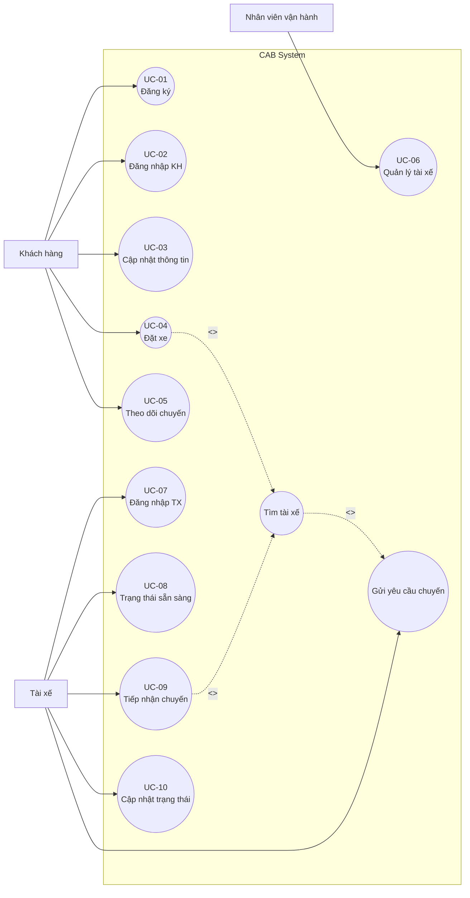
```mermaid
flowchart LR

    KH["Khách hàng"]
    TX["Tài xế"]
    NV["Nhân viên vận hành"]

    subgraph CAB["CAB System"]

        UC01(("UC-01<br/>Đăng ký"))
        UC02(("UC-02<br/>Đăng nhập KH"))
        UC03(("UC-03<br/>Cập nhật thông tin"))
        UC04(("UC-04<br/>Đặt xe"))
        UC05(("UC-05<br/>Theo dõi chuyến"))

        UC06(("UC-06<br/>Quản lý tài xế"))
        UC07(("UC-07<br/>Đăng nhập TX"))
        UC08(("UC-08<br/>Trạng thái sẵn sàng"))
        UC09(("UC-09<br/>Tiếp nhận chuyến"))
        UC10(("UC-10<br/>Cập nhật trạng thái"))

        FIND(("Tìm tài xế"))
        SEND(("Gửi yêu cầu chuyến"))

    end

    KH --> UC01
    KH --> UC02
    KH --> UC03
    KH --> UC04
    KH --> UC05

    TX --> UC07
    TX --> UC08
    TX --> UC09
    TX --> UC10

    NV --> UC06

    UC04 -. "<<include>>" .-> FIND
    FIND -. "<<include>>" .-> SEND

    UC09 -. "<<include>>" .-> FIND
    TX --> SEND
```

---

# B12. ACCEPTANCE CRITERIA

## B12.1. Mục đích

FR chỉ nói hệ thống **phải làm gì**.

AC xác định:
> Làm như thế nào thì được xem là hoàn thành và đủ điều kiện nghiệm thu?

## B12.2. Các bước xây dựng AC

```
FR
 ↓
Xác định điều kiện đầu vào
 ↓
Xác định hành động
 ↓
Xác định kết quả mong đợi
 ↓
Xác định trường hợp lỗi
 ↓
Xác định điều kiện hoàn thành
 ↓
AC
```

## B12.3. AC-01 – Đăng ký tài khoản

| STT | Tiêu chí |
| --- | --- |
| 1 | Khách hàng nhập đầy đủ thông tin bắt buộc. |
| 2 | Hệ thống kiểm tra dữ liệu. |
| 3 | Dữ liệu hợp lệ → tạo tài khoản. |
| 4 | Tài khoản đã tồn tại → thông báo lỗi. |
| 5 | Dữ liệu không hợp lệ → thông báo lỗi. |

## B12.4. AC-02 – Đăng nhập khách hàng

| STT | Tiêu chí |
| --- | --- |
| 1 | Khách hàng nhập thông tin đăng nhập. |
| 2 | Hệ thống xác thực tài khoản. |
| 3 | Thông tin đúng → đăng nhập thành công. |
| 4 | Thông tin sai → thông báo lỗi. |

## B12.5. AC-03 – Cập nhật thông tin

| STT | Tiêu chí |
| --- | --- |
| 1 | Khách hàng đã đăng nhập. |
| 2 | Khách hàng xem được thông tin cá nhân. |
| 3 | Khách hàng chỉnh sửa thông tin được phép. |
| 4 | Hệ thống kiểm tra dữ liệu. |
| 5 | Dữ liệu hợp lệ → lưu thành công. |

## B12.6. AC-04 – Đặt xe

| STT | Tiêu chí |
| --- | --- |
| 1 | Khách hàng nhập điểm đón. |
| 2 | Khách hàng nhập điểm đến. |
| 3 | Hệ thống hiển thị loại xe. |
| 4 | Khách hàng chọn loại xe. |
| 5 | Hệ thống kiểm tra thông tin. |
| 6 | Thông tin hợp lệ → tạo yêu cầu đặt xe. |
| 7 | Hệ thống chuyển yêu cầu sang trạng thái tìm tài xế. |

## B12.7. AC-05 – Theo dõi chuyến

| STT | Tiêu chí |
| --- | --- |
| 1 | Khách hàng xem được chuyến đã đặt. |
| 2 | Hệ thống hiển thị tài xế khi đã phân công. |
| 3 | Hệ thống hiển thị trạng thái hiện tại. |
| 4 | Trạng thái được cập nhật khi tài xế thay đổi. |
| 5 | Khi hoàn thành, trạng thái hiển thị là "Hoàn thành". |

## B12.8. AC-06 – Quản lý thông tin tài xế

| STT | Tiêu chí |
| --- | --- |
| 1 | Nhân viên vận hành xem được danh sách tài xế. |
| 2 | Có thể thêm tài xế. |
| 3 | Có thể cập nhật tài xế. |
| 4 | Có thể cập nhật thông tin phương tiện. |
| 5 | Hệ thống kiểm tra dữ liệu trước khi lưu. |
| 6 | Nhân viên vận hành **không** khóa/mở khóa được tài khoản — chỉ Quản trị viên hệ thống mới thực hiện được (BRL-16). |

## B12.9. AC-07 – Đăng nhập tài xế

| STT | Tiêu chí |
| --- | --- |
| 1 | Tài xế nhập thông tin đăng nhập. |
| 2 | Hệ thống xác thực tài khoản. |
| 3 | Đúng → cho phép truy cập. |
| 4 | Sai → thông báo lỗi. |

## B12.10. AC-08 – Trạng thái sẵn sàng

| STT | Tiêu chí |
| --- | --- |
| 1 | Tài xế đã đăng nhập. |
| 2 | Tài xế xem được trạng thái hiện tại. |
| 3 | Có thể chuyển sang "Sẵn sàng". |
| 4 | Có thể chuyển sang "Không sẵn sàng". |
| 5 | Hệ thống lưu trạng thái mới. |
| 6 | Hệ thống sử dụng trạng thái khi tìm tài xế. |

## B12.11. AC-09 – Tiếp nhận chuyến

| STT | Tiêu chí |
| --- | --- |
| 1 | Hệ thống tìm tài xế đang sẵn sàng. |
| 2 | Tài xế phải phù hợp với loại xe yêu cầu. |
| 3 | Hệ thống gửi yêu cầu cho tài xế. |
| 4 | Tài xế nhận → hệ thống phân công tài xế. |
| 5 | Tài xế từ chối/không phản hồi → tìm tài xế khác. |
| 6 | Không còn tài xế → thông báo khách hàng. |

## B12.12. AC-10 – Cập nhật trạng thái chuyến

| STT | Tiêu chí |
| --- | --- |
| 1 | Chỉ tài xế được phân công mới được cập nhật chuyến. |
| 2 | Trạng thái phải đúng trình tự. |
| 3 | Các trạng thái gồm: Đã nhận chuyến → Đã đến điểm đón → Đã đón khách → Đang di chuyển → Hoàn thành. |
| 4 | Sau mỗi lần cập nhật, hệ thống lưu trạng thái. |
| 5 | Khách hàng xem được trạng thái mới. |
| 6 | Khi trạng thái là Hoàn thành, chuyến được xác nhận hoàn tất. |

---

# B13. REQUIREMENT TRACEABILITY MATRIX

## B13.1. Mục đích

Bảng truy vết dùng để kiểm soát toàn bộ dự án, kể cả những phần bị hoãn — không chỉ phần MVP.

Chuỗi truy vết:

```
Business Objective (BO)
   ↓
Business Requirement (BR)
   ↓
Functional Requirement (FR)
   ↓
Use Case (UC)
   ↓
Acceptance Criteria (AC)
```

## B13.2. Các bước thực hiện

**Bước 1:** Liệt kê Business Objective.
**Bước 2:** Liệt kê BR tương ứng.
**Bước 3:** Xác định FR thực hiện BR.
**Bước 4:** Xác định Use Case.
**Bước 5:** Xác định AC nghiệm thu.
**Bước 6:** Kiểm tra không có BO/BR/FR bị bỏ sót.
**Bước 7:** Kiểm tra chức năng có nằm trong MVP hay không — nếu không, vẫn phải ghi nhận lý do hoãn.

## B13.3. Requirement Traceability Matrix – Phạm vi MVP

| Business | BR | FR | UC | AC | Trạng thái |
| --- | --- | --- | --- | --- | --- |
| B1. Quản lý tài khoản KH | BR-01 | FR-01 | UC-01 | AC-01 | MVP |
| B1. Quản lý tài khoản KH | BR-02 | FR-02 | UC-02 | AC-02 | MVP |
| B1. Quản lý tài khoản KH | BR-03 | FR-03 | UC-03 | AC-03 | MVP |
| B2. Tạo yêu cầu đặt xe | BR-04 | FR-04 | UC-04 | AC-04 | MVP |
| B2. Tạo yêu cầu đặt xe | BR-05 | FR-05 | UC-04 | AC-04 | MVP |
| B2. Tạo yêu cầu đặt xe | BR-06 | FR-06 | UC-04 | AC-04 | MVP |
| B2. Tạo yêu cầu đặt xe | BR-07 | FR-07 | UC-04 | AC-04 | MVP |
| B3. Theo dõi chuyến | BR-08 | FR-08 | UC-05 | AC-05 | MVP |
| B3. Theo dõi chuyến | BR-09 | FR-09 | UC-05 | AC-05 | MVP |
| B3. Theo dõi chuyến | BR-10 | FR-10 | UC-05 | AC-05 | MVP |
| B3. Theo dõi chuyến | BR-11 | FR-11 | UC-05 | AC-05 | MVP |
| B4. Quản lý tài xế | BR-12 | FR-12 | UC-07 | AC-07 | MVP |
| B4. Quản lý tài xế | BR-13 | FR-13 | UC-06 | AC-06 | MVP |
| B4. Quản lý tài xế | BR-14 | FR-14 | UC-06 | AC-06 | MVP |
| B4. Quản lý tài xế | BR-15 | FR-15 | UC-08 | AC-08 | MVP |
| B5. Tiếp nhận chuyến | BR-16 | FR-16 | UC-09 | AC-09 | MVP |
| B5. Tiếp nhận chuyến | BR-17 | FR-17 | UC-09 | AC-09 | MVP |
| B5. Tiếp nhận chuyến | BR-18 | FR-18 | UC-09 | AC-09 | MVP |
| B6. Thực hiện chuyến | BR-19 | FR-19 | UC-10 | AC-10 | MVP |
| B6. Thực hiện chuyến | BR-20 | FR-20 | UC-10 | AC-10 | MVP |
| B7. Tìm tài xế | BR-21 | FR-21 | UC-09 | AC-09 | MVP |
| B7. Tìm tài xế | BR-22 | FR-22 | UC-09 | AC-09 | MVP |
| B7. Tìm tài xế | BR-23 | FR-23 | UC-09 | AC-09 | MVP |
| B8. Xử lý từ chối | BR-24 | FR-24 | UC-09 | AC-09 | MVP |
| B8. Xử lý không có tài xế | BR-25 | FR-25 | UC-09 | AC-09 | MVP |
| B9. Quản lý trạng thái | BR-26 | FR-26 | UC-10 | AC-10 | MVP |

## B13.4. Requirement Traceability Matrix – Ngoài phạm vi MVP *(bổ sung)*

Các yêu cầu dưới đây **có trong yêu cầu khách hàng gốc** (mục 0.1, 0.4, 0.6) nhưng chưa có BR/FR chi tiết vì còn phụ thuộc các câu hỏi mở ở B8.4. Giữ trong bảng truy vết để đảm bảo không bị bỏ sót khi lên kế hoạch giai đoạn 2.

| Business Objective | BR/FR hiện tại | UC dự kiến | Câu hỏi cần chốt trước | Trạng thái |
| --- | --- | --- | --- | --- |
| BO-10. Thanh toán & tính cước | Chưa có | UC-11 | BR-Q05, BR-Q06 | Ngoài MVP – giai đoạn 2 |
| BO-11. Đánh giá tài xế | Chưa có | UC-12 | — | Ngoài MVP – giai đoạn 2 |
| BO-12. Báo cáo vận hành | Chưa có | UC-13 | BR-Q12, BR-Q13 | Ngoài MVP – giai đoạn 2 |
| Ước tính thời gian tài xế đến (ETA) | Chưa có | (mở rộng UC-05) | Phụ thuộc nhà cung cấp bản đồ/GPS | Ngoài MVP – giai đoạn 2 |

## B13.5. Kiểm tra tính đầy đủ

| Nội dung kiểm tra | Kết quả |
| --- | --- |
| Business có BO tương ứng | Đạt |
| BO có BR tương ứng (trong phạm vi MVP) | Đạt |
| BR có FR tương ứng | Đạt |
| FR có Use Case | Đạt |
| Use Case có AC | Đạt |
| Các chức năng chính nằm trong MVP | Đạt |
| Có xử lý trường hợp tài xế từ chối | Đạt |
| Có xử lý không tìm được tài xế | Đạt |
| Có theo dõi trạng thái chuyến | Đạt |
| Có quản lý khách hàng | Đạt |
| Có quản lý tài xế | Đạt |
| **Toàn bộ yêu cầu khách hàng gốc — kể cả phần ngoài MVP — được ghi nhận và truy vết** | **Đạt (xem B13.4)** |
| **Có quy tắc phân quyền Operator/Admin** | **Đạt (BRL-16)** |

---

# TỔNG KẾT TOÀN BỘ QUY TRÌNH BA

```
            YÊU CẦU KHÁCH HÀNG
                    │
                    ▼
           B1. STAKEHOLDER
                    │
                    ▼
        B2. STAKEHOLDER MATRIX
                    │
                    ▼
      B3. BUSINESS OBJECTIVE (BO)
                    │
                    ▼
            B4. XÁC ĐỊNH MVP
            /                 \
           /                   \
Quản lý khách hàng       Quản lý tài xế
           \                   /
            \                 /
             ▼               ▼
             B5. BUSINESS REQUIREMENT (BR)
                      │
                      ▼
            B6. BUSINESS PROCESS
                      │
                      ▼
            B7. FUNCTIONAL REQUIREMENT
                      │
                      ▼
            B8. BUSINESS RULES
                      │
                      ▼
            B9. NON-FUNCTIONAL
                      │
                      ▼
                 B10. ERD
                      │
                      ▼
               B11. USE CASE
                      │
                      ▼
            B12. ACCEPTANCE CRITERIA
                      │
                      ▼
            B13. TRACEABILITY (MVP + ngoài MVP)
                      │
                      ▼
            NGHIỆM THU MVP
```

# PHẠM VI MVP CUỐI CÙNG

## Có trong MVP

- Quản lý khách hàng.
- Đăng ký khách hàng.
- Đăng nhập khách hàng.
- Cập nhật thông tin khách hàng.
- Nhập điểm đón.
- Nhập điểm đến.
- Lựa chọn loại xe.
- Gửi yêu cầu đặt xe.
- Tìm tài xế cơ bản.
- Quản lý tài xế.
- Đăng nhập tài xế.
- Cập nhật trạng thái sẵn sàng.
- Tài xế nhận/từ chối chuyến.
- Phân công tài xế.
- Cập nhật trạng thái chuyến.
- Khách hàng theo dõi trạng thái.
- Lưu lịch sử chuyến.

## Chưa triển khai trong MVP

- Thuật toán chọn tài xế tốt nhất.
- Xếp hạng/điểm tài xế.
- Tối ưu dispatch.
- Tính giá động.
- Voucher.
- Ví điện tử.
- Chat.
- Đặt xe trước.
- Nhiều điểm đón/trả.
- Thanh toán tiền mặt/điện tử và tính cước (BO-10).
- Đánh giá tài xế sau chuyến (BO-11).
- Báo cáo vận hành cho ban giám đốc: số chuyến, doanh thu, tỷ lệ hoàn thành/hủy, hiệu quả tài xế (BO-12).
- Ước tính thời gian tài xế đến (ETA).
- Tích hợp GPS nâng cao.

---

# KẾT LUẬN

Với thời gian triển khai **7 tuần**, CAB System MVP tập trung vào mục tiêu cốt lõi:
> **Xây dựng một hệ thống có thể vận hành được quy trình đặt xe cơ bản từ lúc khách hàng tạo yêu cầu → tìm tài xế → tài xế nhận chuyến → thực hiện chuyến → hoàn thành.**

Hai module chính của MVP là:

1. **Quản lý khách hàng**
2. **Quản lý tài xế**

Trong giai đoạn MVP, hệ thống **không cần tìm tài xế tốt nhất** mà chỉ cần đảm bảo:

```
Khách hàng
    ↓
Chọn điểm đón
    ↓
Chọn điểm đến
    ↓
Chọn loại xe
    ↓
Gửi yêu cầu
    ↓
Tìm tài xế phù hợp
    ↓
Tài xế nhận
    ↓
Thực hiện chuyến
    ↓
Hoàn thành
    ↓
Lưu lịch sử
```

Thanh toán, đánh giá tài xế và báo cáo vận hành (BO-10, BO-11, BO-12) **có thật trong yêu cầu khách hàng** nhưng được chủ động đưa ra ngoài phạm vi 7 tuần đầu; các mục này vẫn được giữ trong bảng truy vết (B13.4) để đội dự án không quên khi bước sang giai đoạn 2, và để ban giám đốc biết rõ đây là lựa chọn đánh đổi có chủ đích, không phải thiếu sót phân tích.
